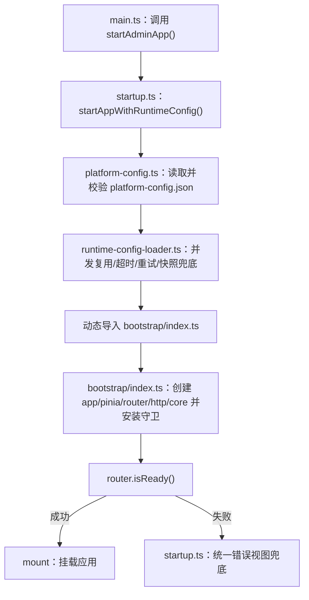
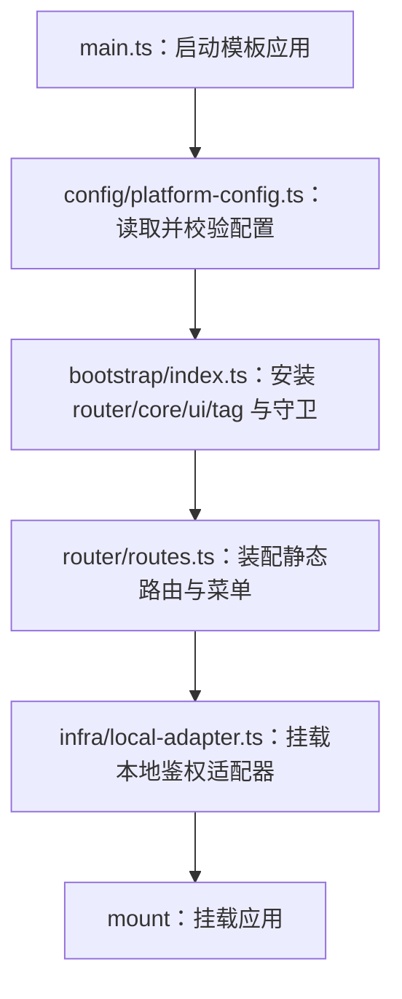
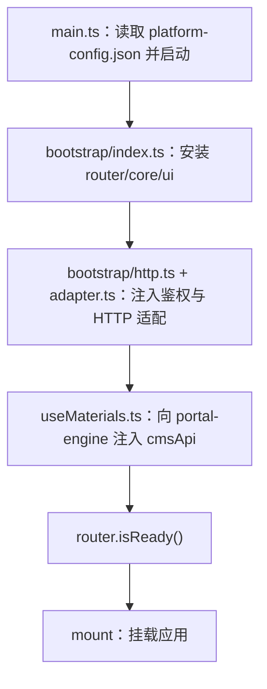

# 启动链路细节（深度）

> 适用范围：`apps/admin`、`apps/portal`、`apps/template`、`packages/app-starter`、`packages/core`

本页承接 [目录结构与边界](/guide/architecture) 的运行时细节，聚焦“应用如何启动、如何收敛路由与运行时配置”。

## admin 启动分层

管理端将启动链路集中在以下位置，避免多入口分叉：

- `apps/admin/src/config/platform-config.ts`：读取并校验 `public/platform-config.json`
- `packages/app-starter/src/runtime-config-loader.ts`：运行时配置加载器（并发复用/超时/重试/快照兜底）
- `packages/app-starter/src/startup.ts`：统一启动编排（load config -> bootstrap -> router.isReady -> mount）
- `apps/admin/src/config/env.ts`：聚合构建期 env 与运行时配置
- `apps/admin/src/router/{types,registry,assemble-routes}.ts`：模块清单扫描与按需路由装配
- `apps/admin/src/bootstrap/index.ts`：创建 app/pinia/router/http/core，并安装插件与守卫
- `apps/admin/src/router/route-assembly-diagnostics.ts`：路由装配诊断聚合（routeCount/skipMenuAuthCount/signature）
- `apps/admin/src/router/route-signature.ts`：路由装配签名计算（确定性诊断）
- `apps/admin/src/bootstrap/startup-profiler.ts`：启动阶段耗时打点与汇总
- `packages/core/src/router/dynamic-import-recovery.ts`：动态路由模块加载失败自动恢复（admin / portal 装配调用）
- `packages/core/src/http/basic-client-signature.ts`：basic 签名请求头注入 helper（admin/portal 共享）
- `packages/core/src/http/client-signature.ts`：basic 签名算法单一实现源（默认参数 + 三段式拼接）
- `apps/admin/src/bootstrap/admin-styles.ts`：基础样式统一入口
- `apps/admin/src/styles/team-overrides.css`：团队覆写样式入口（仅 `main.ts` 引入）

### admin 启动顺序（流程图）

## template 启动分层（最小静态菜单）

- `apps/template/public/platform-config.json`：运行时配置（推荐 `preset=static-single`）
- `apps/template/src/config/platform-config.ts`：配置加载与校验
- `apps/template/src/main.ts`：串联运行时配置与挂载
- `apps/template/src/infra/local-adapter.ts`：本地鉴权适配器
- `apps/template/src/router/routes.ts`：静态路由与菜单来源
- `apps/template/src/bootstrap/index.ts`：安装 router + core + ui + tag + 守卫

### template 启动顺序（流程图）

## portal 启动分层（门户消费者）

- `apps/portal/public/platform-config.json`：运行时配置（默认落地 `/portal/index`）
- `apps/portal/src/main.ts`：串联配置加载与挂载
- `apps/portal/src/bootstrap/index.ts`：安装 router + core + ui，并注入 `http/adapter`
- `apps/portal/src/bootstrap/{http.ts,adapter.ts}`：复用与 admin 一致的鉴权接入
- `apps/portal/src/modules/portal/materials/useMaterials.ts`：向 `portal-engine` 注入 `cmsApi`

### portal 启动顺序（流程图）

### portal 登录与菜单边界

- `admin` / `portal` 共享登录基础能力：
  - `packages/ui/src/components/auth/LoginBox.vue`
  - `packages/ui/src/components/auth/LoginBoxV2.vue`
  - `packages/core/src/auth/login.ts`
- 两端保留各自验证码适配服务：`src/services/auth/auth-captcha-service.ts`
- `portal` 登录成功后优先处理 `redirect`，否则调用 `/cmict/admin/front-config/portal` 做前台分流
- `apps/portal` 保持前台独立边界：默认不接 `/cmict/admin/permission/*` 菜单体系

## 运行时收敛补充（2026-03）

- `bootstrap/index.ts` 内联 `createWebHistory(appEnv.baseUrl)`，避免 `BASE_URL` 来源分散
- runtime config loader 增强：
  - 并发复用
  - 默认 8s 超时
  - 默认 1 次重试
  - 可选快照兜底（`VITE_ENABLE_PLATFORM_CONFIG_SNAPSHOT_FALLBACK=true`）
- `router/registry.ts` 改为两阶段装配：
  - 先扫描 `modules/**/manifest.ts`（eager）
  - 再按 `enabledModules` 动态导入 `modules/**/module.ts`
- `router/assemble-routes.ts` 增加保留 path/name 与重复路由冲突防护
- `router/assemble-routes.ts` 新增 `diagnostics` 输出（由 `route-assembly-diagnostics.ts` 统一生成）：
  - `routeCount`
  - `skipMenuAuthCount`
  - `signature`（由 `route-signature.ts` 生成）
- `bootstrap/plugins.ts` 中 `OneTag.storageKey` 增加 `storageNamespace` 前缀，避免同域冲突
- `bootstrap/index.ts` 接入 `startup-profiler`，记录 `assemble-routes/create-router/create-http/install-core/setup-router-guards` 等关键阶段耗时
- `bootstrap/http.ts` 改为复用 `createBasicClientSignatureBeforeRequest()`，避免 admin/portal 重复维护签名注入逻辑
- `config/basic/client-signature.ts` 与 `config/basic/crypto.ts` 统一复用 `config/basic/signature.ts`（该文件继续复用 `packages/core/src/http/client-signature.ts`），避免签名实现漂移
- `apps/portal/src/bootstrap/index.ts` 也接入 `installRouteDynamicImportRecovery(router)`，与 admin 保持一致恢复策略

## 存储命名空间与首次路由

- `createCore({ storageNamespace })` 为 core 状态增加命名空间前缀（示例：`one-base-template-admin:*`）
- auth/system/menu/layout/tabs/assets 统一遵循命名空间规则，并兼容读取历史无前缀 key
- admin 首次路由落点通过 `getInitialPath()` 统一决策（代码首页优先，菜单叶子兜底）

## 延伸阅读

- [目录结构与边界](/guide/architecture)
- [模块系统与切割](/guide/module-system)
- [菜单与路由规范（Schema）](/guide/menu-route-spec)
- [布局与菜单](/guide/layout-menu)
- [主题系统](/guide/theme-system)
