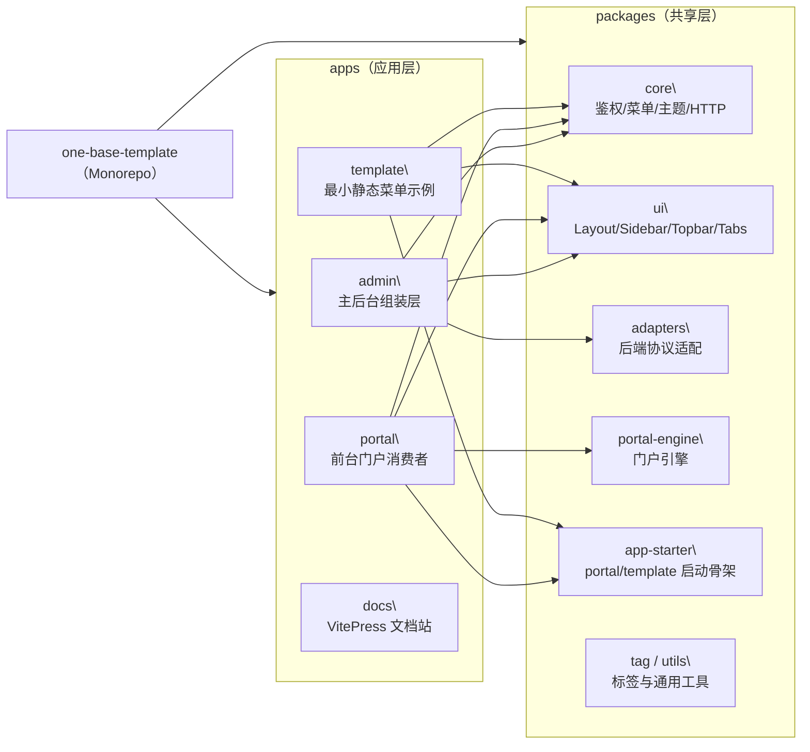

# 目录结构与边界

> 本页是“架构摘要页”，只保留决策级信息。  
> 启动与运行时细节请看：[启动链路细节（深度）](/guide/architecture-runtime-deep-dive)。

仓库根目录：`one-base-template`

## 先看 4 条结论

1. 目录分层按“应用组装（apps）+ 共享能力（packages）”组织，**禁止跨层反向依赖**。
2. `packages/core` 只做逻辑契约，`packages/ui` 只做壳层交互，`packages/adapters` 只做后端协议映射。
3. admin/portal/template 共用同一套分层启动思想（`core + ui + adapter`），但保持各自应用边界。
4. 模块与路由采用 Manifest 装配策略，菜单权限与路由权限按统一契约收敛。

## Monorepo 架构总览（树图）

> 阅读提示：`admin` 当前走本地 `bootstrap` 启动链路；`portal/template` 通过 `app-starter` 收敛运行时配置加载与启动兜底。

## 仓库地图（按职责）

### apps（应用层）

- `apps/admin`：主后台应用（路由装配、业务页面、管理端样式）。
- `apps/portal`：前台门户消费者应用（独立渲染入口，不接后台菜单接口）。
- `apps/template`：最小静态菜单示例（验证模板闭环）。
- `apps/docs`：文档站（规则、架构、实践沉淀）。

### packages（共享层）

- `packages/app-starter`：跨应用启动编排与运行时配置加载器。
- `packages/core`：鉴权、菜单、主题、HTTP、store 等纯逻辑能力（无 UI 依赖）。
- `packages/ui`：布局壳、导航壳、页面容器、错误页等可复用 UI 壳。
- `packages/tag`：标签栏能力包（tag store + route guard 协作）。
- `packages/portal-engine`：门户编辑/渲染共享引擎（admin 与 portal 复用）。
- `packages/adapters`：后端接口协议适配与字段映射。
- `packages/utils`：通用工具函数与 hooks。

## 边界铁律（必须遵守）

- `packages/core`：不引入 `element-plus` 等具体 UI 库，不假设后端字段格式。
- `packages/ui`：只消费 core 提供的状态与契约，不反向依赖 `apps/*`。
- `packages/adapters`：只处理接口协议与数据映射，不承载页面逻辑。
- `apps/*`：以“组装”为主，优先复用 packages 能力，避免在应用层复制核心逻辑。

## 启动链路摘要

- admin：`main.ts -> startAdminApp() -> bootstrap/startup.ts -> bootstrap/index.ts -> mount`
- template：同骨架最小化运行，默认静态菜单与本地 adapter。
- portal：沿用骨架并保留前台独立边界，登录后做前台分流。

深度说明请看：

- [启动链路细节（深度）](/guide/architecture-runtime-deep-dive)

## 路由与模块摘要

- 模块入口：`manifest.ts + module.ts`（先声明元数据，再按白名单装配路由）。
- 菜单模式：`remote`（后端菜单树）或 `static`（静态路由生成）。
- 权限判定：默认 `allowedPaths` 由菜单树推导，非菜单路由通过 `meta.activePath` 或 `meta.skipMenuAuth` 处理。

深度说明请看：

- [模块系统与切割](/guide/module-system)
- [菜单与路由规范（Schema）](/guide/menu-route-spec)
- [布局与菜单](/guide/layout-menu)

## 主题与样式摘要

- 主题引擎下沉到 `packages/core`，admin 仅注册业务主题。
- token 通过运行时注入统一映射到 `--one-*` / `--el-*`，避免页面散落硬编码色值。
- admin 样式入口收敛为“bootstrap 基础样式 + main 团队覆写样式”。

深度说明请看：

- [主题系统](/guide/theme-system)

## 推荐阅读路径

1. 先读本页，明确边界与分层。
2. 再读 [启动链路细节（深度）](/guide/architecture-runtime-deep-dive) 理解启动编排。
3. 开发模块前读 [模块系统与切割](/guide/module-system) 与 [菜单与路由规范（Schema）](/guide/menu-route-spec)。
4. 提测前回到 [开发规范与维护](/guide/development) 做验证闭环。
