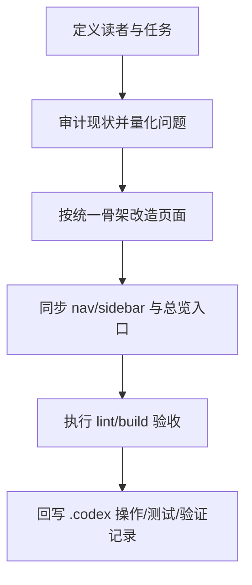

# 技术文档协作与改造手册

<div class="doc-tldr">
  <strong>TL;DR：</strong>本页提供 docs 项目可执行改造方法：先做受众与问题审计，再按统一骨架改页面，最后用 lint/build 验收并回写维护记录。
</div>

## 适用范围

- 适用目录：`apps/docs/docs/**`
- 适用场景：重构技术文档、补齐维护规范、治理导航与侧边栏
- 目标读者：文档维护者、业务开发者、新接手同学

## 1. 要解决的问题

当前 `guide` 目录页面数量已经到 `45`，但结构一致性不足，主要问题如下：

1. 高流量页面骨架不统一，读者在“概念页”和“操作页”之间切换成本高。
2. 一部分页面缺少“最小可运行路径”，新同学难以独立完成首跑。
3. 维护治理文档较多，但“如何持续改文档”的流程尚未形成统一主线。

### 1.1 本轮审计快照

| 指标（`guide/*.md`）  | 当前值 | 说明                       |
| --------------------- | ------ | -------------------------- |
| 页面总数              | `45`   | 覆盖范围广，需控制维护成本 |
| 含 TL;DR 页面         | `14`   | 首屏结论覆盖不足           |
| 含“适用范围”页面      | `22`   | 一半以上页面仍缺范围声明   |
| 含“步骤/快速路径”页面 | `4`    | 可执行路径明显偏少         |
| 含“验证/验收”页面     | `27`   | 验收口径还可继续统一       |
| 含 FAQ 页面           | `8`    | 常见问题沉淀不充分         |

## 2. 为什么要解决这个问题

- **协作价值**：降低“口头传递”依赖，让新同学只看文档也能推进任务。
- **工程价值**：减少因规则误读引发的返工与误改。
- **治理价值**：把“分析 -> 改造 -> 验收 -> 维护触发”沉淀成可复用流程。

## 3. 范围与非范围

### 3.1 In Scope

1. 统一关键入口页面骨架（TL;DR、范围、前置条件、步骤、验证、FAQ）。
2. 同步导航与总览页，确保新增文档 3 次点击内可达。
3. 输出可执行验收命令与维护触发条件。

### 3.2 Out of Scope

1. 一次性全量重写全部 `45` 页文档。
2. 修改业务运行时代码。
3. 引入新的文档构建插件或外部搜索服务。

## 4. 假设清单（可验证）

| 假设                   | 影响范围           | 验证方式                                     |
| ---------------------- | ------------------ | -------------------------------------------- |
| 维护者以中文为主       | 文档正文与标题语义 | 抽检页面标题与术语是否中文化                 |
| 构建链路稳定           | docs 发布与预览    | `pnpm -C apps/docs build`                    |
| 导航入口是主要检索路径 | 新增页面可发现性   | 核对 `config.ts` + `guide/index.md` 是否同步 |

## 5. 最小可运行路径

在仓库根目录执行：

```bash
pnpm -C apps/docs lint
pnpm -C apps/docs build
```

预期结果：

1. `lint` 无 warning / error。
2. `build` 成功，新增页面可在导航与总览页进入。

失败处理：

| 现象                      | 常见原因                         | 处理方式                                                  |
| ------------------------- | -------------------------------- | --------------------------------------------------------- |
| 构建报 404 或死链         | 新增页面未进导航或路径拼写错误   | 同步修正 `apps/docs/docs/.vitepress/config.ts` 与页面链接 |
| lint 报 markdown 结构问题 | 标题层级不连续或代码块缺语言标记 | 按“标题不超三级 + 代码块标注语言”修正                     |
| 页面可访问但搜索命中差    | 标题过于抽象、关键词缺失         | 重写标题为“动作 + 对象”并补关键术语                       |

## 6. 文档入口清单（完整）

> 说明：本页将文档可访问入口视作“文档端点”，用于维护导航完整性。

| 模块 | 页面名                 | Path                               | 入口分组 | 维护责任                 |
| ---- | ---------------------- | ---------------------------------- | -------- | ------------------------ |
| 入门 | 快速开始               | `/guide/quick-start`               | 入门     | docs 维护者              |
| 架构 | 目录结构与边界         | `/guide/architecture`              | 架构     | docs 维护者              |
| 实践 | CRUD 开发规范          | `/guide/crud-module-best-practice` | 开发实践 | 模块维护者 + docs 维护者 |
| 治理 | 开发规范与维护         | `/guide/development`               | 维护治理 | docs 维护者              |
| 治理 | 技术文档协作与改造手册 | `/guide/tech-doc-collaboration`    | 维护治理 | docs 维护者              |

## 7. 协作流程



## 8. 验证与验收

### 8.1 验证命令

```bash
pnpm -C apps/docs lint
pnpm -C apps/docs build
```

### 8.2 通过标准

1. 命令执行成功。
2. 页面路径可访问，且导航、总览、正文互链一致。
3. 关键入口页具备统一骨架字段。

### 8.3 发布前检查

- [ ] 顶部导航入口不超过 7 个
- [ ] 侧边栏按任务流组织
- [ ] 新增页面在 `guide/index.md` 有入口
- [ ] 页面含“步骤 + 验证 + 失败处理”

## 9. 未决问题与后续计划

| 问题                     | 影响               | Owner       | 计划时间           |
| ------------------------ | ------------------ | ----------- | ------------------ |
| 长尾页面结构差异仍大     | 文档体验不完全统一 | docs 维护者 | 2026-04 批次化收口 |
| 页面级维护责任未显式标注 | 更新责任边界不清晰 | 模块维护者  | 2026-04 补齐       |

## 10. 维护信息

- 文档维护人：`apps/docs` 维护者
- 更新触发条件：
  1. 导航或侧边栏结构调整
  2. 关键命令与验证流程变化
  3. 入口页模板字段调整
- 相关阅读：
  - [开发规范与维护](/guide/development)
  - [文档总览](/guide/)
  - [AGENTS 规则分层](/guide/agents-scope)
