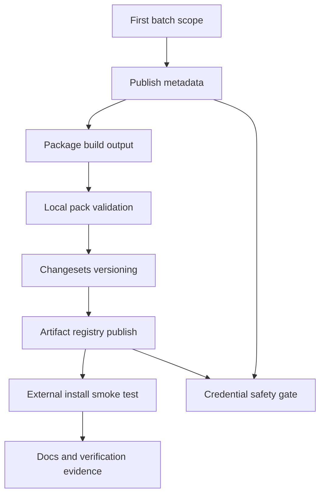

# Public Packages Release - Plan

## Goal Capsule

- **Objective:** 将第一批稳定公共包发布化，使外部项目可以从公司制品 npm 仓库安装 `@one-base-template/core`、`@one-base-template/utils`、`@one-base-template/tag`、`@one-base-template/ui`，并让版本升级由 changesets 管理。
- **Product authority:** 用户指定“先根据建议”推进；第一批范围采用前置结论，只发布 `core/utils/tag/ui`，暂不全量发布 `packages/*`。
- **Execution profile:** Standard；该计划改动包发布契约、构建产物、版本管理、文档与验证流程。
- **Stop conditions:** 发现私服权限无法验证、构建产物无法被外部项目消费、或必须改变第一批发布包范围时停止并回报。
- **Tail ownership:** 执行完成后应由仓库内计划、文档站、changeset 记录和验证证据共同沉淀发布规则。

---

## Product Contract

### Summary

第一批发布化只覆盖已经具有跨项目复用价值且依赖关系可控的公共包：`core`、`utils`、`tag`、`ui`。
目标不是马上把所有 workspace 包推上私服，而是建立可重复的发布基线：可构建产物、可安装依赖、可追踪版本、可验证发布包内容。

### Problem Frame

当前仓库已经有 changesets 脚本，但公共包仍是 workspace 内部源码包形态：包版本统一为 `0.0.0`，包私有标记为 `private: true`，导出入口大多指向 TS / Vue 源码。
这对 monorepo 内部开发有效，但外部项目通过 npm registry 安装时会承担编译源码、解析 workspace 依赖、识别样式入口和处理 peer 依赖的额外风险。

### Requirements

**Publish scope**

- R1. 第一批只发布 `@one-base-template/core`、`@one-base-template/utils`、`@one-base-template/tag`、`@one-base-template/ui`。
- R2. `adapters`、`app-starter`、`portal-engine`、`document-form-engine` 暂不进入第一批发布范围，除非后续明确有外部消费场景。
- R3. 发布范围必须显式可控，不能通过根级 `@one-base-template/*` 泛匹配把所有包误发布。

**Package contract**

- R4. 第一批包必须从 `private: true` 转为可发布包，并补齐稳定的 `publishConfig`、`files` 和外部消费入口。
- R5. 发布包入口必须指向可安装产物，不再把外部消费方默认暴露到 `src/*.ts` 或未构建的 Vue 源码入口。
- R6. `@one-base-template/ui` 对 `core`、`tag` 的内部依赖必须在发布后转换为 semver 兼容范围，而不是留下不可被外部 registry 解析的 workspace 协议。
- R7. 样式入口必须保留 `@one-base-template/tag/style` 这类对外路径，并确保发布包包含对应样式资产。

**Version and release governance**

- R8. 第一批包版本从 `0.1.0` 起步，后续通过 changesets 管理 patch / minor / major。
- R9. 已存在但目标包缺失的 changeset 记录必须先处理，避免 `version:packages` 对不存在包报错或生成错误版本记录。
- R10. 发布验证必须在正式 publish 前完成包内容检查与外部安装 smoke test。

**Credential safety**

- R11. 制品仓库认证信息不得写入仓库 `.npmrc`、文档明文示例或提交内容。
- R12. 私服 registry 配置只允许作为本机临时配置、CI secret 注入或脱敏文档示例出现。

### Scope Boundaries

#### In Scope

- 第一批发布包的 package metadata、构建产物入口、版本 changeset、发布脚本或校验脚本。
- 发布文档和文档站入口，说明包范围、版本规则、私服配置方式和验证流程。
- 发布前的本地 pack / 安装 smoke test 设计。

#### Deferred to Follow-Up Work

- 将 `portal-engine`、`document-form-engine`、`adapters`、`app-starter` 纳入第二批发布。
- 为每个包设计独立 API reference 或更细粒度迁移指南。
- CI 自动发布流水线和私服 token 的 CI secret 配置。

#### Out of Scope

- 本计划不执行真实 npm publish。
- 本计划不把用户给出的 `_auth` 写入仓库文件。
- 本计划不重构公共包业务 API 或扩大公共能力导出面。

### Acceptance Examples

- AE1. 在一个临时外部项目里配置公司 npm registry 后，可以安装第一批四个包，并解析 `core`、`utils`、`tag/style`、`ui` 的主入口。
- AE2. 运行 changesets 版本流程时，只更新第一批目标包及其必要内部依赖版本，不处理缺失的 `@one-base-template/lint-ruleset`。
- AE3. 检查 git diff 时，仓库 `.npmrc` 和文档中没有真实 `_auth` 值。

### Assumptions

- 私服支持 scoped package 发布，并接受 `@one-base-template/*` 包名。
- 第一批外部消费方能接受 ESM 包和 peer dependency 模式。
- 真实发布凭据由用户本机 npm 配置或 CI secret 提供，不由仓库保存。

---

## Planning Contract

### Key Technical Decisions

- KTD1. **先发布最小稳定集合。** 第一批选 `core/utils/tag/ui`，因为它们已经是应用和组件层复用基础；其余包要么绑定后端协议，要么引擎体量更大，先进入后续批次能降低首发风险。
- KTD2. **发布构建产物，不发布源码入口作为默认运行入口。** 外部项目不应依赖本仓库的 TS / Vue 编译假设；包应提供 `dist` 下的 JS、类型声明和样式资产。
- KTD3. **继续使用 changesets 作为版本事实源。** 根脚本已存在 `changeset`、`version:packages`、`release:packages`，计划应修正当前包契约并补发布验证，而不是引入另一套版本工具。
- KTD4. **认证配置只在执行环境生效。** 私服地址可文档化，真实 `_auth` 只能通过本机或 CI 注入，避免仓库泄露凭据。
- KTD5. **发布前先 pack 验证，再 registry smoke。** 先用本地 pack 检查包内容与外部安装，再在私服环境执行发布和安装验证，可以把包结构问题和权限问题分开定位。

### High-Level Technical Design

### Sequencing

1. Clean stale version state before touching package publishability.
2. Convert package metadata and build outputs for the first batch.
3. Add validation and smoke test scaffolding.
4. Update docs and changeset policy.
5. Run local validation before any real publish.

### Sources and Research

- `package.json`: root already exposes `changeset`, `version:packages`, and `release:packages`.
- `.changeset/config.json`: current changesets config uses public access and `updateInternalDependencies: patch`.
- `.changeset/calm-pumas-kiss.md`: current pending changeset references missing `@one-base-template/lint-ruleset`.
- `packages/core/package.json`, `packages/utils/package.json`, `packages/tag/package.json`, `packages/ui/package.json`: first-batch packages are currently private and versioned `0.0.0`.
- `pnpm-workspace.yaml`: workspace includes `packages/*`; pnpm workspace protocol can convert internal dependencies during publish when package metadata is valid.

---

## Implementation Units

### U1. Clean Release State

- **Goal:** Remove or resolve version records that reference packages not present in the workspace so the version flow starts from a valid graph.
- **Requirements:** R8, R9.
- **Dependencies:** None.
- **Files:**
  - `.changeset/calm-pumas-kiss.md`
  - `.changeset/README.md`
  - `docs/plans/2026-06-30-001-feat-public-packages-release-plan.md`
- **Approach:** Treat the existing `@one-base-template/lint-ruleset` changeset as stale unless the missing package is intentionally restored before execution. Do not let stale changeset content ride along with the first public package release.
- **Patterns to follow:** Existing `.changeset/README.md` describes one changeset per release-worthy change.
- **Test scenarios:**
  - Given the current workspace has no `@one-base-template/lint-ruleset`, when the changeset list is checked, then no active changeset references that package.
  - Given a first-batch release changeset is created, when package names are read, then every referenced package exists under `packages/*`.
- **Verification:** The changeset set names only existing first-batch packages or intentionally restored packages.

### U2. Define First-Batch Publish Metadata

- **Goal:** Make `core`, `utils`, `tag`, and `ui` explicitly publishable while leaving all other packages private.
- **Requirements:** R1, R2, R3, R4, R6, R7, R11, R12.
- **Dependencies:** U1.
- **Files:**
  - `packages/core/package.json`
  - `packages/utils/package.json`
  - `packages/tag/package.json`
  - `packages/ui/package.json`
  - `packages/adapters/package.json`
  - `packages/app-starter/package.json`
  - `packages/document-form-engine/package.json`
  - `packages/portal-engine/package.json`
  - `.npmrc`
  - `pnpm-workspace.yaml`
- **Approach:** Remove private publish blocking only from first-batch packages, add package-level publish metadata, and keep non-batch packages private. Convert `ui` internal dependencies from `workspace:*` to a publishing-friendly compatible workspace range. Keep credential-bearing registry config out of committed `.npmrc`.
- **Patterns to follow:** `packages/core/AGENTS.md` and `packages/ui/AGENTS.md` boundaries: core stays UI-library-free; ui may depend on core/tag but never apps.
- **Test scenarios:**
  - Given package metadata is read for first-batch packages, when checking publishability, then each package is not private and has publish metadata.
  - Given package metadata is read for deferred packages, when checking publishability, then each remains private or otherwise excluded from publish.
  - Given `packages/ui/package.json` is read after versioning, when resolving internal dependencies, then `core` and `tag` publish as semver ranges.
  - Given `.npmrc` is inspected, when searching for `_auth`, then no real authentication value is committed.
- **Verification:** Package metadata distinguishes first-batch publishable packages from deferred private packages, and no credential appears in tracked files.

### U3. Build Publishable Artifacts

- **Goal:** Produce external-consumer-friendly package artifacts instead of exposing raw source files as default exports.
- **Requirements:** R4, R5, R6, R7.
- **Dependencies:** U2.
- **Files:**
  - `packages/core/package.json`
  - `packages/utils/package.json`
  - `packages/tag/package.json`
  - `packages/ui/package.json`
  - `packages/core/tsconfig.json`
  - `packages/utils/tsconfig.json`
  - `packages/tag/tsconfig.json`
  - `packages/ui/tsconfig.json`
  - `scripts/*`
  - `package.json`
- **Approach:** Add or reuse package build configuration that emits JS and declaration files into each package's publish directory. Ensure subpath exports in `ui` and style exports in `tag` point to emitted files or copied assets included by `files`.
- **Patterns to follow:** Existing package boundaries and export names should stay stable; this unit changes distribution shape, not public API semantics.
- **Test scenarios:**
  - Given each first-batch package is built, when inspecting its publish directory, then JS and declaration outputs exist for every exported entry.
  - Given `@one-base-template/tag/style` is packed, when inspecting package contents, then the referenced CSS or SCSS asset is present.
  - Given `@one-base-template/ui/rich-text-v2` is exported, when inspecting package contents, then the subpath resolves to emitted output and its declaration.
  - Given non-batch packages are built by normal workspace commands, when running existing checks, then their private status is not changed by publish artifact work.
- **Verification:** Local package artifacts can be imported by an external fixture without relying on the repository `src` tree.

### U4. Add Release Validation

- **Goal:** Create a repeatable validation flow that catches bad package contents before real publish and verifies install from the configured registry after publish.
- **Requirements:** R3, R10, R11, R12, AE1, AE2, AE3.
- **Dependencies:** U2, U3.
- **Files:**
  - `package.json`
  - `scripts/*`
  - `.gitignore`
  - `.codex/testing.md`
  - `.codex/verification.md`
  - `.codex/verification/2026-06-30.md`
- **Approach:** Add release validation around local pack output, package allowlist, dependency resolution, and a temporary consumer fixture. The validation should accept registry configuration from the execution environment and must not require tracked auth config.
- **Patterns to follow:** Existing root scripts use repo-local `scripts/*` and validation records live under `.codex/testing.md` and `.codex/verification/YYYY-MM-DD.md`.
- **Test scenarios:**
  - Given the allowlist contains four first-batch packages, when validation runs, then only those packages are packed or published.
  - Given a package tarball is produced, when an external fixture installs it, then imports resolve without workspace links.
  - Given registry env is absent, when registry smoke is requested, then validation reports a clear missing-config failure rather than writing auth to `.npmrc`.
  - Given tracked files are scanned, when searching for the real auth token shape, then no credential is present.
- **Verification:** Local pack validation passes for the first-batch packages, and registry smoke can be run only with externally supplied credentials.

### U5. Version the First Release

- **Goal:** Establish initial `0.1.0` versions for the first batch and document how future changes advance versions.
- **Requirements:** R8, R9, R10, AE2.
- **Dependencies:** U1, U2, U3, U4.
- **Files:**
  - `.changeset/*.md`
  - `packages/core/package.json`
  - `packages/utils/package.json`
  - `packages/tag/package.json`
  - `packages/ui/package.json`
  - `pnpm-lock.yaml`
  - `CHANGELOG.md`
  - `packages/core/CHANGELOG.md`
  - `packages/utils/CHANGELOG.md`
  - `packages/tag/CHANGELOG.md`
  - `packages/ui/CHANGELOG.md`
- **Approach:** Use changesets to create the first public release versions rather than hand-editing unrelated package versions. Keep future semver rules simple: patch for compatible fixes, minor for new exports or behavior, major for breaking API or export path changes.
- **Patterns to follow:** Existing root scripts `version:packages` and `release:packages`.
- **Test scenarios:**
  - Given the first release changeset is applied, when package versions are inspected, then first-batch packages move from `0.0.0` to the intended public baseline.
  - Given `ui` depends on `core` and `tag`, when versioning completes, then internal dependency ranges are compatible with the released versions.
  - Given deferred packages remain private, when versioning completes, then they are not accidentally assigned first-release public versions.
- **Verification:** Version files, changelogs, and lockfile reflect only the first-batch release set and necessary dependency updates.

### U6. Document Release Usage and Governance

- **Goal:** Make the publishing process repeatable for future maintainers without exposing credentials.
- **Requirements:** R8, R10, R11, R12, AE1, AE3.
- **Dependencies:** U4, U5.
- **Files:**
  - `apps/docs/docs/guide/development.md`
  - `apps/docs/docs/guide/index.md`
  - `apps/docs/docs/.vitepress/config.ts`
  - `apps/docs/docs/guide/package-release.md`
  - `.changeset/README.md`
  - `.codex/operations-log.md`
  - `.codex/testing.md`
  - `.codex/verification/2026-06-30.md`
- **Approach:** Add a docs page covering first-batch package scope, version rules, local/CI credential boundaries, pack validation, publish flow, and post-publish install smoke. Include registry examples with placeholders only.
- **Patterns to follow:** `apps/docs/AGENTS.md` requires docs nav and overview updates for new guide pages.
- **Test scenarios:**
  - Given the docs page is rendered, when scanning examples, then auth values are placeholders and not real tokens.
  - Given the docs navigation is opened, when looking for package release guidance, then the new page is reachable from the guide area.
  - Given future maintainers read `.changeset/README.md`, when deciding version level, then patch/minor/major policy is clear.
- **Verification:** Docs lint/build pass and the published guidance matches the implemented release scripts and package metadata.

---

## Verification Contract

| Gate                   | Applies to | Done signal                                                                                                      |
| ---------------------- | ---------- | ---------------------------------------------------------------------------------------------------------------- |
| Package metadata audit | U1, U2, U5 | First-batch packages are publishable; deferred packages are not accidentally publishable.                        |
| Build artifact audit   | U3         | First-batch packages emit JS, declarations, and required style assets into publishable contents.                 |
| Local pack smoke       | U3, U4     | Tarballs install into a temporary consumer without workspace links.                                              |
| Registry smoke         | U4, U5     | With externally supplied registry/auth config, first-batch packages can be installed from the artifact registry. |
| Credential scan        | U2, U4, U6 | No real `_auth` value is present in tracked files or docs.                                                       |
| Package validation     | U1-U6      | Relevant `typecheck`, `lint`, package tests, and docs build pass for changed areas.                              |

---

## Risks and Mitigations

- **Raw source leakage:** Current exports point at source files. Mitigate by making publishable artifacts the default export target before publishing.
- **Over-publishing:** Root wildcard scripts can accidentally include all scoped packages. Mitigate with an explicit first-batch allowlist and metadata audit.
- **Credential leakage:** User supplied a real auth-looking value in the prompt. Mitigate by never writing it to tracked files and by scanning tracked changes before commit.
- **Dependency mismatch:** `ui` depends on `core` and `tag`. Mitigate by versioning the first batch together and validating external install.
- **Style asset omission:** `tag/style` is a public path. Mitigate by checking packed contents for style files.

---

## System-Wide Impact

This work changes the boundary between monorepo-only packages and external npm consumers.
After it lands, package exports and dependency metadata become public contract, so future changes to export paths, peer dependency ranges, and style entries require semver treatment.

---

## Definition of Done

- First-batch package scope is explicit and limited to `core/utils/tag/ui`.
- First-batch packages have real public versions and publishable package metadata.
- Default package exports resolve to publishable artifacts, not repository-only source paths.
- Local pack validation and temporary consumer install pass for first-batch packages.
- Registry publish/install smoke has either passed with externally supplied credentials or is clearly marked blocked by missing private registry access.
- Documentation describes release scope, versioning policy, credential handling, and verification flow.
- No real registry auth value is committed.
- Dead-end release experiments, temporary fixture output, and generated tarballs are removed or ignored before completion.
