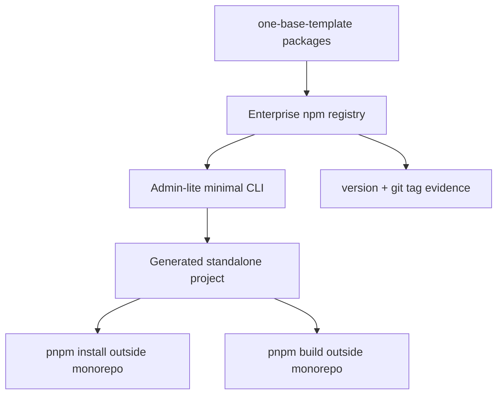
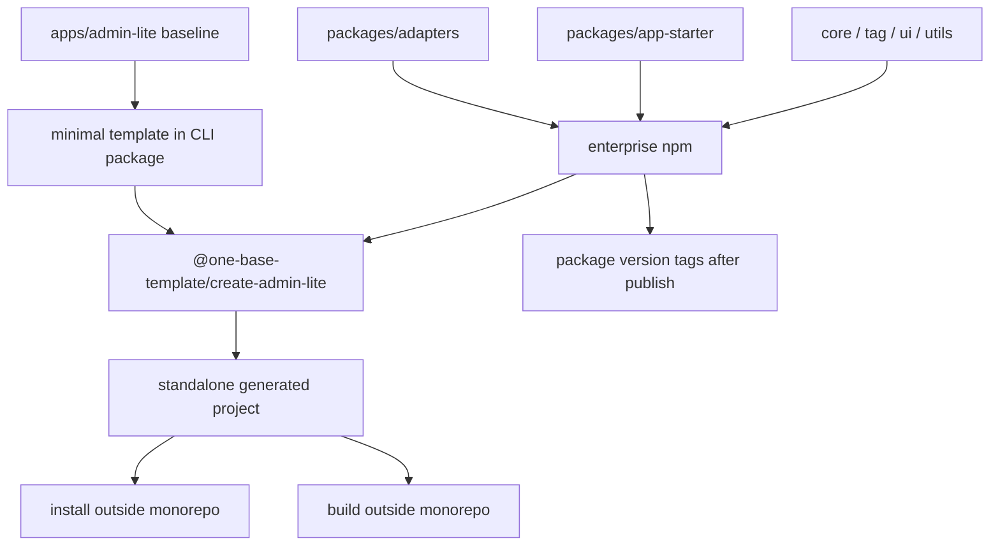

# Admin Lite Minimal CLI - Plan

## Goal Capsule

- **Objective:** 以 `admin-lite` 为来源，定义一个面向企业 npm 的最小后台基座 CLI，让生成项目可以在 monorepo 外独立安装、启动和构建。
- **Product authority:** 用户确认第一版选择“完全独立 + 最小可运行基座”，不追求当前 `admin-lite` 全量等价。
- **Execution profile:** Deep-feature；该需求跨公共包发布、模板裁剪、CLI 生成行为、企业 npm 安装和仓库外验证。
- **Open blockers:** 无阻塞规划的问题；企业 npm 凭证、CLI 包命名和模板裁剪清单在实施计划阶段定稿。
- **Tail ownership:** 最终状态应由企业 npm 包版本、CLI 使用文档、仓库外 smoke 证据和 package 发布 tag 共同证明。

---

## Product Contract

### Summary

第一版 CLI 生成一个最小 `admin-lite` 后台基座，而不是复制完整 monorepo 应用。
生成项目必须脱离 `one-base-template` 仓库运行，所有内部公共能力都从企业 npm 安装。

### Problem Frame

首批公共包已经把 `core`、`tag`、`utils`、`ui` 推向企业 npm 消费形态，但 `admin-lite` 仍保留部分 workspace 依赖、catalog 版本和 monorepo 相对脚本。
现有 `new:app` 更适合在仓库内创建新 app，不能作为给外部项目使用的初始化 CLI。
如果直接把当前 `admin-lite` 原样作为模板，生成物会继承太多内部模块、内部脚本和 workspace 假设，导致“能复制出来”但不能独立交付。

### Key Decisions

- **最小基座优先。** 第一版只保留登录、首页、布局、路由、运行配置、启动链路等起项目必需能力，管理模块和示例模块后置。
- **企业 npm 是内部能力唯一来源。** 生成项目不得通过 workspace、软链或本机仓库路径消费 `@one-base-template/*`。
- **CLI 面向仓库外项目。** 成功标准是外部目录的 install/build，而不是 monorepo 内部 `new:app` 复制成功。
- **发布可追溯。** 第二批公共包和 CLI 包每次真实发布都必须有版本记录和 git tag 依据。

### Actors

- A1. **项目初始化者:** 使用 CLI 创建一个新的后台项目，并期望立刻安装、启动和二次开发。
- A2. **公共包维护者:** 维护 `@one-base-template/*` 包的发布范围、版本和 tag。
- A3. **企业 npm 仓库:** 承载内部公共包、CLI 包和后续安装解析。
- A4. **生成项目:** CLI 输出的独立 Vue 后台项目，是本需求的验收对象。

### Requirements

**Enterprise npm package closure**

- R1. 生成项目运行时导入的所有 `@one-base-template/*` 包都必须来自企业 npm 上的普通版本依赖。
- R2. `@one-base-template/adapters` 和 `@one-base-template/app-starter` 必须被纳入第二批企业 npm 发布范围，或在最小模板中被明确移除或替换。
- R3. `@one-base-template/portal-engine` 和 `@one-base-template/document-form-engine` 不进入第一版最小 CLI 范围，除非模板实际依赖它们。
- R4. 生成项目的依赖版本必须使用 npm 可解析的 semver 范围，不能包含 `workspace:*`、`catalog:` 或本机路径依赖。
- R5. 公共包发布必须遵守版本和 tag 规则，每次真实推送 package 都要有对应 git tag 或明确记录未打 tag 的阻断原因。

**Minimal template**

- R6. 默认模板必须包含登录页、首页、应用壳、路由、运行时配置、HTTP、鉴权、菜单和主题启动所需的最小闭环。
- R7. 默认模板不得包含管理模块、日志模块、系统字典、demo 模块和 starter-crud 示例模块的默认路由或页面。
- R8. 默认模板必须保留团队扩展入口，让后续项目可以继续注入插件、模块和业务页面。
- R9. 生成项目的 `package.json` 脚本必须能在仓库外执行，不能调用 `../../scripts/*` 或依赖 monorepo 根脚本。
- R10. 生成项目的开发工具依赖必须是普通 npm 依赖，不能依赖根级 catalog 解析。

**CLI behavior**

- R11. CLI 必须支持指定项目名和目标目录，并在目标目录生成独立项目。
- R12. CLI 必须在目标目录已存在且非空、项目名非法、或缺少必要参数时给出明确失败信息。
- R13. CLI 不得写入真实 npm `_auth`、token 或账号密码；registry 配置只能通过说明、占位符或用户环境提供。
- R14. CLI 输出应包含最小启动说明，使初始化者知道如何配置企业 npm registry、安装依赖、启动开发服务和构建产物。

**Verification and governance**

- R15. 最小验收必须在仓库外临时目录执行，证明生成项目不依赖 `one-base-template` 工作区。
- R16. 验收必须覆盖 install、typecheck 或 build 中至少一个真实编译门禁，并优先覆盖 build。
- R17. 验收必须检查生成项目中不存在 `workspace:`、`catalog:`、`../../scripts`、真实 `_auth` 和指向本机仓库的路径。
- R18. 文档必须说明第一版 CLI 的默认范围、延期能力、企业 npm 配置方式和包版本升级规则。

### Key Flows

- F1. **公共包闭环**
  - **Actors:** A2, A3.
  - **Steps:** 维护者确认最小模板依赖图，发布必要的 `@one-base-template/*` 包到企业 npm，并为真实发布生成版本与 tag 证据。
  - **Outcome:** 模板所需内部包都能通过企业 npm 安装。
  - **Covered by:** R1, R2, R3, R4, R5.

- F2. **项目初始化**
  - **Actors:** A1, A3, A4.
  - **Steps:** 初始化者配置企业 npm registry，运行 CLI 指定项目名和目标目录，进入生成项目安装依赖并执行构建。
  - **Outcome:** 新项目在仓库外完成安装和构建，不需要访问 monorepo。
  - **Covered by:** R6, R9, R10, R11, R14, R15, R16.

- F3. **范围扩展**
  - **Actors:** A1, A2.
  - **Steps:** 第一版项目先通过扩展入口接入业务代码；管理模块、模块生成器和架构检查能力在后续版本单独加入。
  - **Outcome:** CLI v1 先解决起项目问题，后续版本再补开发套件能力。
  - **Covered by:** R7, R8, R18.



### Acceptance Examples

- AE1. 在仓库外临时目录运行 CLI 生成项目后，`package.json` 中没有 `workspace:`、`catalog:`、`../../scripts` 或本机绝对路径。
- AE2. 在配置企业 npm registry 的环境中，生成项目可以完成依赖安装，并从企业 npm 解析所有 `@one-base-template/*` 包。
- AE3. 生成项目默认只出现登录、首页和应用壳相关路由，不默认携带管理模块、日志模块、系统字典、demo 或 starter-crud 页面。
- AE4. 生成项目执行 build 通过，且构建过程不访问 `one-base-template` 仓库路径。
- AE5. 检查生成项目和仓库改动时，不存在真实 `_auth`、token 或账号密码。
- AE6. 发布第二批公共包或 CLI 包时，可以在 git tag 或发布记录中追溯本次 package 版本。

### Scope Boundaries

**In Scope**

- 第二批最小依赖包发布范围确认，重点是 `adapters` 和 `app-starter`。
- 最小 `admin-lite` 模板范围定义。
- 仓库外可用的 CLI 生成行为。
- 企业 npm 安装说明、版本升级规则和 tag 追溯要求。
- 仓库外生成、安装、构建 smoke 验收。

**Deferred for Later**

- 当前 `admin-lite` 全量模块等价迁移。
- `new:module`、`new:module:item`、`lint:arch` 等开发辅助命令的 CLI 化。
- 管理模块、日志模块、系统字典、demo 和 starter-crud 的可选模板开关。
- CI 自动发布流水线和企业 npm token 的 CI secret 配置。
- CLI 模板多 preset、模板市场或远程模板下载能力。

**Out of Scope**

- 第一版不发布或消费 `portal-engine` 与 `document-form-engine`。
- 第一版不修改 `apps/admin` 的运行行为。
- 第一版不把真实 npm 认证信息写入仓库或生成项目。
- 第一版不面向公网 npm 仓库发布。

### Dependencies / Assumptions

- 企业 npm 仓库支持 scoped package 和 CLI 包安装。
- 发布凭证由用户本机 npm 配置或 CI secret 提供，不由仓库保存。
- 首批已发布的 `core`、`tag`、`utils`、`ui` 可以继续作为远程依赖消费。
- 第二批是否发布 `adapters` 和 `app-starter` 以最小模板实际依赖为准。
- Vue、Vite、Pinia、Element Plus 等外部依赖可从配置的 npm registry 正常安装。

### Outstanding Questions

**Deferred to Planning**

- CLI 包名采用 `@one-base-template/create-admin-lite`、`create-one-base-template` 还是其他命名。
- 最小模板是从 `apps/admin-lite` 裁剪生成，还是维护独立模板目录。
- 生成项目是否默认保留测试配置，或第一版只保留 dev/build/typecheck。
- 企业 npm registry 配置是只写文档，还是提供可选 `.npmrc.example`。

### Sources / Research

- `apps/admin-lite/package.json`: 当前 `core`、`tag`、`ui` 已使用远程版本，但 `adapters`、`app-starter` 仍是 `workspace:*`，脚本仍包含 `../../scripts/*` 和 `catalog:`。
- `scripts/new-app.mjs`: 当前脚手架是 monorepo 内复制到 `apps/<app-id>` 的工具，不是仓库外 CLI。
- `packages/adapters/package.json`: 当前包仍为 `private: true`，并依赖 `@one-base-template/core` 的 workspace 协议。
- `packages/app-starter/package.json`: 当前包仍为 `private: true`，导出仍指向源码入口。
- `docs/plans/2026-06-30-001-feat-public-packages-release-plan.md`: 首批发布范围只覆盖 `core`、`utils`、`tag`、`ui`，并明确延期 `adapters` 和 `app-starter`。
- `.codex/operations-log.md`: 已记录首批公共包发布链路和凭证不入仓原则。

---

## Planning Contract

### Product Contract Preservation

Product Contract unchanged.

### Key Technical Decisions

- KTD1. **第二批发布 `adapters` 与 `app-starter`。** `admin-lite` 当前仍声明这两个 workspace 依赖，先把它们纳入企业 npm 发布闭环，比在模板里临时绕开更符合“其他 monorepo 包也替换为远程包”的目标。
- KTD2. **CLI 包名采用 `@one-base-template/create-admin-lite`。** 该命名和目标能力直接对应，适合通过企业 npm 安装或 `pnpm dlx` 执行；后续如需多模板入口，再扩展到更泛化的 create 包。
- KTD3. **模板随 CLI 包发布。** 生成项目不能依赖仓库路径，因此最小模板必须作为 CLI package 的 `files` 内容发布，而不是运行时从 `apps/admin-lite` 复制。
- KTD4. **模板内容从 `admin-lite` 裁剪，不改变 `admin-lite` 主应用定位。** `apps/admin-lite` 继续作为仓库内基座；CLI 模板只拿最小启动闭环，管理模块、示例模块和仓库内脚本留在后续版本。
- KTD5. **生成项目使用普通 npm 依赖和本地脚本。** 输出项目里的 `package.json` 只允许 semver 版本、项目内脚本和公开 CLI 命令，不能依赖 `catalog:`、`workspace:`、`../../scripts` 或 monorepo 根配置。
- KTD6. **发布验证先用本地 pack，再做企业 npm smoke。** 本地验证覆盖包结构、CLI 生成、外部目录安装和构建；真实 registry 安装和 tag 只在 publish 成功后执行。

### High-Level Technical Design



### Assumptions

- `@one-base-template/create-admin-lite` 是第一版 CLI 的包名；如果后续要做多模板中心，再以兼容方式增加别名或新入口。
- 第二批包初始版本采用 `0.1.0`，与首批公共包首发口径一致。
- 最小模板仍保留 `basic` 后端适配能力，因此需要 `@one-base-template/adapters` 作为远程依赖。
- `@one-base-template/app-starter` 先作为可发布公共包闭环处理；模板如不直接使用它，也不得再把它作为 workspace 依赖带进生成项目。
- 企业 npm 凭证由执行环境提供；实现只能写 registry 占位说明和凭证安全检查。

### Output Structure

```text
packages/create-admin-lite/
  bin/
    create-admin-lite.mjs
  templates/
    admin-lite-minimal/
      package.json
      src/
      build/
  package.json
  README.md
scripts/
  validate-admin-lite-cli.mjs
```

### Sequencing

1. 先让第二批包具备可发布产物与本地 pack 校验能力。
2. 再新增 CLI 包和最小模板，保证模板不再依赖 monorepo。
3. 再补独立验证脚本，用本地 tarball 模拟企业 npm 消费。
4. 最后同步文档、规则和 changeset，使版本、tag、凭证边界可追溯。

### Risks and Mitigations

- **包依赖仍残留 workspace 协议。** 在 release 校验和 CLI 校验里同时扫描 `workspace:`、`catalog:`、`../../scripts`、本机仓库路径和真实 `_auth`。
- **模板与 `apps/admin-lite` 漂移。** 第一版接受显式模板目录，文档写清它是 CLI v1 的最小模板；后续如漂移成本变高，再规划模板同步脚本。
- **`app-starter` 发布后无人直接消费。** 本轮仍发布它以消除 `admin-lite` workspace 依赖；如果实现发现模板和 app 都不需要它，生成项目不得保留该依赖。
- **真实企业 npm smoke 依赖凭证。** 本地 Definition of Done 到 pack 和外部临时项目构建；真实 publish 后 smoke 和 tag 作为发布窗口动作记录。

---

## Implementation Units

### U1. Publish Second-Batch Runtime Packages

- **Goal:** 让 `@one-base-template/adapters` 与 `@one-base-template/app-starter` 具备与首批公共包一致的发布元数据、dist 产物和 changesets 治理入口。
- **Requirements:** R1, R2, R4, R5, AE2, AE6.
- **Dependencies:** None.
- **Files:**
  - `packages/adapters/package.json`
  - `packages/adapters/tsconfig.build.json`
  - `packages/adapters/vite.config.ts`
  - `packages/app-starter/package.json`
  - `packages/app-starter/tsconfig.build.json`
  - `packages/app-starter/vite.config.ts`
  - `scripts/build-public-package.mjs`
  - `scripts/validate-public-packages.mjs`
  - `.changeset/config.json`
  - `.changeset/*.md`
- **Approach:** 复用首批包的 `dist` 发布模式，为两个包补齐 `main/module/types/files/publishConfig/exports` 和构建配置；把它们加入公共包构建与校验 allowlist，并从 changesets ignore 中移除。
- **Patterns to follow:** `packages/core/package.json`、`packages/utils/tsconfig.build.json`、`packages/core/vite.config.ts`、`scripts/validate-public-packages.mjs` 的 metadata audit 和本地 pack 模式。
- **Test scenarios:**
  - Given `adapters` 和 `app-starter` 完成构建, when 校验 dist, then 每个对外 export 都有 JS 与声明文件产物。
  - Given `adapters` 发布包被打包, when 检查其依赖, then `@one-base-template/core` 在发布时可转换为 semver 范围。
  - Given changesets 配置被读取, when 校验 ignore 列表, then 第二批包不再被排除。
  - Given tracked files 被扫描, when 匹配 npm auth 模式, then 不存在真实凭证。
- **Verification:** 两个包可独立 `typecheck`、`lint`、`build`，并被根级 release 校验纳入本地 tarball 和 consumer fixture。

### U2. Add Standalone Create Admin Lite CLI Package

- **Goal:** 新增可发布 CLI 包，支持在仓库外生成最小后台项目。
- **Requirements:** R11, R12, R13, R14, AE1, AE5.
- **Dependencies:** U1.
- **Files:**
  - `packages/create-admin-lite/package.json`
  - `packages/create-admin-lite/bin/create-admin-lite.mjs`
  - `packages/create-admin-lite/README.md`
  - `packages/create-admin-lite/templates/admin-lite-minimal/**`
  - `.changeset/config.json`
  - `.changeset/*.md`
- **Approach:** 使用 Node ESM 实现零运行时依赖 CLI，支持项目名、目标目录、`--help` 和基础参数校验；目标目录存在且非空时失败；生成后只输出普通启动说明和 registry 配置提示，不写入认证信息。
- **Patterns to follow:** `scripts/new-app.mjs` 的项目名校验、dry-run 思路和复制模板方式；但输出路径改为任意目录，不再写入 `apps/<app-id>`。
- **Test scenarios:**
  - Given 用户传入合法项目名和空目录, when 运行 CLI, then 目标目录生成完整项目。
  - Given 目标目录非空, when 运行 CLI, then CLI 失败且不覆盖现有文件。
  - Given 项目名包含非法字符, when 运行 CLI, then CLI 失败且提示项目名问题。
  - Given 运行 `--help`, when 输出帮助信息, then 不创建文件。
  - Given 生成项目完成, when 扫描文件, then 不存在真实 `_auth`、token 或本机仓库路径。
- **Verification:** CLI package 可通过本地 Node 执行生成项目，并可被 `pnpm pack` 打成包含模板的 tarball。

### U3. Build the Minimal Admin Lite Template

- **Goal:** 将最小可运行 `admin-lite` 基座固化到 CLI 模板，输出项目只包含启动闭环，不包含默认管理业务模块。
- **Requirements:** R6, R7, R8, R9, R10, AE1, AE3, AE4.
- **Dependencies:** U1, U2.
- **Files:**
  - `packages/create-admin-lite/templates/admin-lite-minimal/package.json`
  - `packages/create-admin-lite/templates/admin-lite-minimal/index.html`
  - `packages/create-admin-lite/templates/admin-lite-minimal/vite.config.ts`
  - `packages/create-admin-lite/templates/admin-lite-minimal/tsconfig.json`
  - `packages/create-admin-lite/templates/admin-lite-minimal/postcss.config.js`
  - `packages/create-admin-lite/templates/admin-lite-minimal/tailwind.config.ts`
  - `packages/create-admin-lite/templates/admin-lite-minimal/build/**`
  - `packages/create-admin-lite/templates/admin-lite-minimal/src/**`
- **Approach:** 从 `apps/admin-lite` 裁剪出 `main/bootstrap/config/router/home/login/sso/top/styles/types/utils` 等最小启动文件，删除 `adminManagement`、`SystemManagement`、`LogManagement`、`demoManagement`、`starter-crud` 和人员选择器等非默认模板能力；脚本改为 `vp dev/build/preview`、`vue-tsc --noEmit`、`vp test` 这类仓库外可运行命令。
- **Patterns to follow:** `apps/admin-lite/src/config/app.ts` 的 minimal preset 思路、`apps/admin-lite/src/router/registry.ts` 的模块白名单机制、`apps/admin-lite/build/vite-plugins.ts` 的插件配置。
- **Test scenarios:**
  - Given 生成项目的 `src/modules`, when 列出模块目录, then 默认只有 `home`。
  - Given 生成项目的 `package.json`, when 检查 dependencies 和 devDependencies, then `@one-base-template/*` 都是 semver，Vite 工具链不使用 catalog。
  - Given 生成项目的脚本被读取, when 搜索 `../../scripts`, then 没有匹配。
  - Given 生成项目执行构建, when 解析 import, then 所有 `@one-base-template/*` 从包依赖解析，不访问 monorepo 源码。
  - Given 团队需要扩展插件, when 查看 `src/main.ts`, then 仍存在主入口扩展钩子。
- **Verification:** 生成项目在仓库外目录完成 install 和 build，且静态扫描确认无 monorepo 依赖假设。

### U4. Add Standalone CLI Validation

- **Goal:** 为 CLI 和第二批包提供可重复的本地验证，模拟企业 npm 之前的外部项目消费。
- **Requirements:** R15, R16, R17, AE1, AE2, AE4, AE5.
- **Dependencies:** U1, U2, U3.
- **Files:**
  - `scripts/validate-admin-lite-cli.mjs`
  - `package.json`
  - `.gitignore`
  - `scripts/validate-public-packages.mjs`
- **Approach:** 新增验证脚本：本地 pack 必要公共包和 CLI 包，在 `.tmp` 外部消费目录用 tarball 或 pnpm overrides 生成并安装项目，然后执行静态扫描和 build；校验失败时输出具体违反项。
- **Patterns to follow:** `scripts/validate-public-packages.mjs` 的 temp fixture、tarball、credential scan 和 consumer build 流程。
- **Test scenarios:**
  - Given 本地包未构建, when 执行 CLI 验证, then 验证先构建或明确提示缺失产物。
  - Given 生成项目残留 `workspace:`、`catalog:`、`../../scripts` 或仓库绝对路径, when 静态扫描, then 验证失败。
  - Given 生成项目依赖通过本地 tarball 覆盖, when install/build, then 不访问企业 npm 也能验证包结构。
  - Given 缺少 CLI 模板文件, when 运行验证, then 失败并指出缺失路径。
- **Verification:** 根脚本暴露 CLI 验证入口，并在无企业 npm 凭证环境下完成本地闭环。

### U5. Switch Admin Lite Workspace Dependencies to Remote Versions

- **Goal:** 让仓库内 `apps/admin-lite` 自身也不再声明 `adapters` 和 `app-starter` 的 workspace 依赖。
- **Requirements:** R1, R2, R4, AE2.
- **Dependencies:** U1.
- **Files:**
  - `apps/admin-lite/package.json`
  - `apps/admin-lite/vite.config.ts`
  - `pnpm-lock.yaml`
- **Approach:** 把 `@one-base-template/adapters`、`@one-base-template/app-starter` 切到第二批版本号；移除 Vite 对未发布 workspace 包的优化排除说明；通过 install 锁定 lockfile 的远程依赖形态。
- **Patterns to follow:** 已完成的 `core/tag/ui` 远程依赖切换方式，以及 `apps/admin-lite` 现有 Vite 配置。
- **Test scenarios:**
  - Given `apps/admin-lite/package.json` 被读取, when 检查 `@one-base-template/*`, then 不再出现 workspace 协议。
  - Given Vite 配置被读取, when 检查 workspace 源码包排除列表, then 不再保留已发布包的特殊排除。
  - Given `admin-lite` 执行 typecheck/build, when 解析 `adapters`, then 从依赖包入口解析。
- **Verification:** `admin-lite` install、typecheck 和 build 通过，且静态扫描不再发现 workspace 依赖。

### U6. Update Documentation and Governance

- **Goal:** 将第二批包、CLI 用法、tag 规则和验证证据同步到仓库文档与操作记录。
- **Requirements:** R5, R13, R14, R18, AE5, AE6.
- **Dependencies:** U1, U2, U3, U4, U5.
- **Files:**
  - `AGENTS.md`
  - `.changeset/README.md`
  - `apps/docs/docs/guide/package-release.md`
  - `apps/docs/docs/guide/admin-lite-base-app.md`
  - `apps/docs/docs/guide/quick-start.md`
  - `apps/docs/docs/.vitepress/config.ts`
  - `.codex/operations-log.md`
  - `.codex/testing.md`
  - `.codex/verification.md`
  - `.codex/verification/2026-06-30.md`
- **Approach:** 更新发布范围、CLI 使用方式、企业 npm registry 配置、凭证安全和发布后 tag 规则；确保 docs 站有入口；`.codex` 记录实现和验证结果。
- **Patterns to follow:** `apps/docs/docs/guide/package-release.md` 的发布流程结构、根 `AGENTS.md` 已有 package tag 规则、`.codex/verification/YYYY-MM-DD.md` 的验证记录格式。
- **Test scenarios:**
  - Given 文档站导航被读取, when 搜索 CLI 或 package release 入口, then 用户能从治理或 admin-lite 文档进入。
  - Given 发布文档被读取, when 搜索 tag 规则, then 明确“真实 publish 成功后每包 tag 必打”。
  - Given 文档和 tracked files 被扫描, when 匹配 npm auth, then 不存在真实凭证。
- **Verification:** docs lint/build 通过，`.codex` 记录包含本轮核心命令结果和未执行真实 publish 的边界。

---

## Verification Contract

| Gate                      | Command                                                              | Applies To | Done Signal                                                |
| ------------------------- | -------------------------------------------------------------------- | ---------- | ---------------------------------------------------------- |
| Package build             | `pnpm release:build`                                                 | U1, U5     | 公共包 dist 产物生成成功                                   |
| Package validation        | `pnpm release:validate`                                              | U1, U4, U5 | package metadata、凭证扫描、本地 pack/install/build 全通过 |
| CLI standalone validation | `pnpm validate:admin-lite-cli`                                       | U2, U3, U4 | 仓库外临时项目生成、静态扫描、install/build 全通过         |
| Admin-lite regression     | `pnpm -C apps/admin-lite typecheck && pnpm -C apps/admin-lite build` | U5         | `admin-lite` 远程依赖切换后类型和构建通过                  |
| Docs validation           | `pnpm -C apps/docs lint && pnpm -C apps/docs build`                  | U6         | 文档导航和内容构建通过                                     |

If enterprise npm credentials are unavailable, local completion stops at pack-based validation.
After a real `pnpm release:packages` succeeds, run registry install smoke for the published packages and create package version tags using `<package-name>@<version>`.

---

## Definition of Done

- Product Contract remains unchanged unless the user explicitly revises scope.
- `@one-base-template/adapters` and `@one-base-template/app-starter` have publishable metadata, dist outputs, and release validation coverage.
- `@one-base-template/create-admin-lite` exists as a publishable CLI package with a packaged minimal template.
- Generated projects contain no `workspace:`, `catalog:`, `../../scripts`, real `_auth`, token, or local repo path.
- Generated projects can install and build outside the monorepo using local tarball validation, and can use enterprise npm after publish credentials are supplied.
- `apps/admin-lite` no longer declares `adapters` or `app-starter` as workspace dependencies.
- Docs explain CLI usage, first-version scope, deferred capabilities, enterprise npm setup, credential safety, version upgrade, and package tag rules.
- `.codex` records the commands run, pass/fail result, and any publish-only work not executed locally.
- Abandoned prototype files, temporary generated projects, and `.tmp` artifacts are not left tracked in git.
