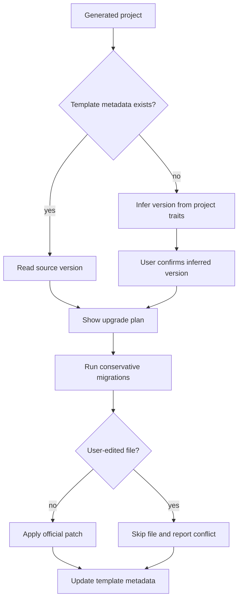
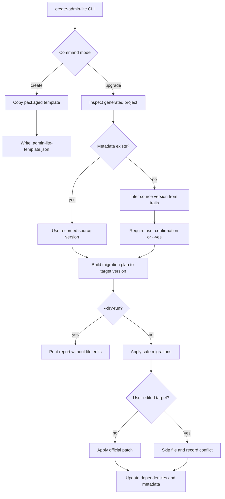

# Admin Lite CLI Upgrade - Plan

## Goal Capsule

- **Objective:** 给 `@one-base-template/create-admin-lite` 增加保守升级能力，让旧版 CLI 已生成的项目可以安全吸收新版模板修复和公共包版本升级。
- **Product authority:** 用户确认第一版选择保守迁移、旧项目自动识别并让用户确认、默认升级到 `latest` 且支持指定目标版本。
- **Execution profile:** Standard；该需求改动 CLI 对外命令、生成项目元信息、迁移规则、验证脚本和文档。
- **Open blockers:** 无阻塞问题；实现阶段只需按计划处理版本解析和冲突输出细节。
- **Tail ownership:** LFG 负责从计划、实现、简化、审查、浏览器验证到提交推送的完整尾部。

---

## Product Contract

### Summary

`create-admin-lite upgrade` 将为已生成项目提供安全升级路径。
它默认升到企业 npm 上的最新版 CLI 模板口径，也允许指定目标版本；遇到用户改过的模板文件时提示冲突，不强行覆盖。

### Problem Frame

当前 CLI 生成项目时复制的是 `@one-base-template/create-admin-lite` 包内随包发布的模板。
一旦项目生成完成，后续 CLI 新版本不会自动影响这个项目。
公共包 bug 可以通过依赖升级解决，但模板文件 bug 需要一个可追溯、可控的迁移机制，否则团队只能手动对比新旧模板。

### Key Decisions

- **保守迁移优先。** 第一版自动处理低风险升级，保护生成项目中的业务改动。
- **旧项目自动识别。** 对没有模板版本记录的存量项目，CLI 先推断来源版本，再让用户确认。
- **默认升到 latest。** 普通使用者执行 upgrade 即可追到最新版；需要固定版本时再指定目标版本。
- **新项目写入模板元信息。** 后续生成项目必须记录模板来源和版本，减少未来升级时的猜测。

### Actors

- A1. **已生成项目维护者:** 在独立项目中执行升级，希望拿到模板修复但不丢失业务改动。
- A2. **CLI 维护者:** 发布模板新版本和迁移规则，保证升级链路可追溯。
- A3. **企业 npm 仓库:** 提供 CLI 最新版本、指定版本和公共包版本解析。
- A4. **已生成项目:** 被升级的独立项目，可能来自新版本模板，也可能是没有版本记录的早期项目。

### Requirements

**Upgrade command behavior**

- R1. CLI 必须提供 `upgrade` 命令，用于在已生成项目根目录执行升级。
- R2. `upgrade` 默认以企业 npm 上的最新模板版本为目标版本。
- R3. `upgrade` 必须支持指定目标版本，方便团队固定升级范围。
- R4. `upgrade` 必须在执行前展示来源版本、目标版本和计划动作，并要求用户确认后再写入文件。
- R5. `upgrade` 必须支持只检查不写入的模式，用于 CI 或人工预检。

**Template version identity**

- R6. 新生成项目必须写入模板元信息，至少记录 CLI 包名、模板名和模板版本。
- R7. 已有项目缺少模板元信息时，CLI 必须通过项目特征自动推断来源版本。
- R8. 来源版本推断不确定时，CLI 必须让用户确认或手动指定来源版本。
- R9. CLI 不得在无法识别项目来源时继续执行模板文件迁移。

**Conservative migration**

- R10. 升级公共包版本是第一版自动迁移的默认能力。
- R11. 模板文件升级必须通过官方迁移规则执行，而不是直接覆盖为最新模板。
- R12. 当目标文件疑似被用户改过时，CLI 必须跳过自动覆盖并报告冲突。
- R13. 冲突报告必须告诉用户哪些文件需要人工处理，以及本次升级已完成和未完成的部分。
- R14. 成功升级后，CLI 必须更新项目中的模板元信息。

**Safety and governance**

- R15. 升级过程不得写入 npm `_auth`、token、账号密码或本机绝对路径。
- R16. 迁移规则必须按版本链路顺序执行，避免从旧版本直接跳到新版本时漏掉中间修复。
- R17. 每次发布涉及模板升级行为的 CLI 新版本时，必须有 changeset、版本 tag 和升级说明。
- R18. 文档必须说明 create 与 upgrade 的关系：create 生成新项目，upgrade 维护已生成项目。

### Key Flows

- F1. **新项目可升级来源记录**
  - **Actors:** A1, A4.
  - **Steps:** 用户执行 create 生成项目，项目内写入模板元信息，后续 upgrade 直接读取来源版本。
  - **Outcome:** 新项目未来升级不依赖特征猜测。
  - **Covered by:** R6, R14, R18.

- F2. **有版本记录的项目升级**
  - **Actors:** A1, A2, A3, A4.
  - **Steps:** 用户在项目根目录执行 upgrade，CLI 读取模板元信息，解析目标版本，展示计划动作，用户确认后执行迁移并更新版本记录。
  - **Outcome:** 项目安全升级到目标模板版本。
  - **Covered by:** R1, R2, R3, R4, R10, R11, R14, R16.

- F3. **无版本记录的旧项目升级**
  - **Actors:** A1, A4.
  - **Steps:** CLI 扫描项目特征并推断来源版本，展示推断结果，用户确认后继续迁移；无法推断时停止并提示手动指定来源版本。
  - **Outcome:** 早期生成项目也有受控升级路径。
  - **Covered by:** R7, R8, R9.

- F4. **用户改过模板文件的冲突处理**
  - **Actors:** A1, A4.
  - **Steps:** 迁移命中文件前检查文件状态；如果文件已偏离官方基线，跳过该文件自动改动并写入冲突报告。
  - **Outcome:** 升级不会覆盖业务改动，用户能看到后续手动处理清单。
  - **Covered by:** R12, R13, R15.



### Acceptance Examples

- AE1. 新执行 create 生成的项目包含模板元信息，记录 `@one-base-template/create-admin-lite` 和当前模板版本。
- AE2. 在已生成项目中执行 upgrade 时，CLI 默认解析企业 npm 上的最新版作为目标版本。
- AE3. 执行 upgrade 并指定目标版本时，CLI 只计划升级到该版本。
- AE4. 旧项目没有模板元信息时，CLI 能展示推断来源版本并等待用户确认。
- AE5. CLI 无法可靠识别旧项目来源时，不执行模板迁移，并提示用户指定来源版本。
- AE6. 当迁移命中文件已被用户修改时，CLI 不覆盖该文件，并输出冲突清单。
- AE7. 成功升级后，项目依赖和模板元信息反映目标版本。
- AE8. 生成项目和升级产物中不存在真实 `_auth`、token、账号密码或本机绝对路径。

### Scope Boundaries

**In Scope**

- `create-admin-lite upgrade` 的用户体验和安全边界。
- 新生成项目的模板元信息记录。
- 存量旧项目的来源版本自动识别和用户确认。
- 公共包版本升级与官方模板迁移规则。
- 冲突检测、冲突报告和只检查不写入模式。
- 文档中补充 create / upgrade / package version 的关系。

**Deferred for Later**

- 最新模板与旧项目之间的自动三方合并。
- 多模板中心、远程模板市场或模板插件系统。
- 将任意手写项目转换为 admin-lite 模板项目。
- 业务模块级迁移助手。
- CI 自动 PR 升级机器人。

**Out of Scope**

- 第一版不强制把旧项目改成与最新模板完全一致。
- 第一版不覆盖用户已经修改过的模板文件。
- 第一版不把企业 npm 认证信息写入项目仓库。

### Dependencies / Assumptions

- 企业 npm 能解析 `@one-base-template/create-admin-lite` 的最新版本和指定版本。
- 迁移规则由 CLI 包随版本发布，不依赖用户本机的 monorepo 路径。
- 旧项目的可识别特征足以覆盖近期由 CLI 生成的项目；无法覆盖时走人工指定来源版本。
- 公共包 bug 仍优先通过依赖版本升级解决；模板文件 bug 才进入迁移规则。

### Outstanding Questions

**Deferred to Planning**

- 模板元信息文件名和字段格式。
- 只检查不写入模式的命令命名。
- 来源版本自动识别的具体特征集合。
- 迁移冲突报告是只输出控制台，还是同时写入项目内报告文件。
- 迁移规则失败后的回滚策略和中断恢复策略。

### Sources / Research

- `docs/plans/2026-06-30-002-feat-admin-lite-minimal-cli-plan.md`: 已确认 CLI 模板随 `@one-base-template/create-admin-lite` 包发布，不运行时读取 `apps/admin-lite`。
- `packages/create-admin-lite/bin/create-admin-lite.mjs`: 当前 CLI 只有 create 流程，复制包内 `templates/admin-lite-minimal` 到目标目录。
- `packages/create-admin-lite/package.json`: 当前发布包 `files` 包含 `bin` 和 `templates`，说明模板是包内容的一部分。

---

## Planning Contract

### Product Contract Preservation

Product Contract unchanged.

### Key Technical Decisions

- KTD1. **模板元信息使用项目根 `.admin-lite-template.json`。** 这是最容易被已生成项目携带和升级命令定位的位置，不依赖 package manager 或应用源码。
- KTD2. **默认目标版本取当前运行的 CLI 包版本。** 推荐使用 `pnpm dlx @one-base-template/create-admin-lite@latest upgrade`，因此当前 CLI 自身就是 latest；如果用户用旧 CLI 指定高于当前包的版本，CLI 应提示先运行 latest。
- KTD3. **旧项目来源版本通过保守特征推断。** 识别范围先覆盖当前已发布的 `admin-lite-minimal` 项目形态；无法可靠识别时停止模板迁移。
- KTD4. **迁移规则以版本链路组织。** 每个迁移只声明自己的前置版本、目标版本、计划动作和安全检查，避免跨版本跳跃漏掉中间修复。
- KTD5. **文件迁移必须先做基线检查。** 能确认是官方旧基线的文件可自动改；疑似用户改过的文件跳过并进入冲突报告。
- KTD6. **只检查模式命名为 `--dry-run`。** 该命名与仓库内脚手架使用习惯一致，适合人工预检和 CI。
- KTD7. **冲突报告同时输出到控制台和项目内报告文件。** 控制台便于即时阅读，报告文件便于 PR 或后续人工处理。

### High-Level Technical Design



### Assumptions

- 企业 npm 上的 latest 执行入口通过 `pnpm dlx @one-base-template/create-admin-lite@latest upgrade` 获取；旧 CLI 不负责下载未来版本的迁移规则。
- 当前第一版升级能力只覆盖 `admin-lite-minimal` 模板，不覆盖仓库内 `pnpm new:app` 派生应用。
- 公共包依赖升级以生成项目模板中声明的 `@one-base-template/*` 版本为准，不主动改业务依赖。
- 旧项目没有元信息时，推断结果需要 `--yes` 或交互确认；无交互环境下推断不确定则失败。

### Output Structure

```text
packages/create-admin-lite/
  bin/
    create-admin-lite.mjs
  templates/
    admin-lite-minimal/
      .admin-lite-template.json
      package.json
      src/
  README.md
scripts/
  validate-admin-lite-cli.mjs
apps/docs/docs/guide/
  admin-lite-base-app.md
  package-release.md
```

### Sequencing

1. 先给 create 流程写入模板元信息，并把 CLI 入口拆成 create / upgrade 两个命令模式。
2. 再实现 upgrade 的项目识别、目标版本解析、dry-run 和确认门禁。
3. 再实现保守迁移引擎、首批迁移规则和冲突报告。
4. 再扩展 CLI 验证脚本，覆盖新项目元信息、旧项目升级、冲突跳过和安全扫描。
5. 最后更新 README、docs 与 changeset，保留发布和升级口径。

### Risks and Mitigations

- **误改业务项目文件。** 迁移前做官方基线检查；不能确认安全的文件只报告冲突。
- **旧项目版本推断错误。** 缺少元信息时要求用户确认；非交互模式必须显式传入确认或来源版本。
- **默认 latest 让旧 CLI 误导用户。** 当目标版本高于当前 CLI 包版本时，提示用户使用 `@latest` 重新执行。
- **迁移规则膨胀成模板合并器。** 第一版只做官方声明的补丁和依赖升级，不做自动三方 merge。
- **凭证泄露。** 复用现有安全扫描，继续阻断 `_auth`、token、本机路径和 registry 认证值进入生成项目。

---

## Implementation Units

### U1. Add Template Metadata to Create Flow

- **Goal:** 新生成项目自动携带模板来源和版本，给后续 upgrade 提供稳定来源。
- **Requirements:** R6, R14, R15, AE1, AE7, AE8.
- **Dependencies:** None.
- **Files:**
  - `packages/create-admin-lite/bin/create-admin-lite.mjs`
  - `packages/create-admin-lite/templates/admin-lite-minimal/.admin-lite-template.json`
  - `packages/create-admin-lite/templates/admin-lite-minimal/README.md`
  - `scripts/validate-admin-lite-cli.mjs`
- **Approach:** 在模板目录中保留占位元信息，create 完成 token 替换后用当前 CLI `package.json` 版本写入项目根 `.admin-lite-template.json`；元信息包含 CLI 包名、模板名、模板版本和生成时间，不包含本机路径或认证信息。
- **Patterns to follow:** `create-admin-lite.mjs` 现有 token replacement 流程；`validate-admin-lite-cli.mjs` 的生成项目安全扫描。
- **Test scenarios:**
  - Given 新项目通过 CLI 生成, when 读取 `.admin-lite-template.json`, then 包名、模板名和模板版本存在且版本等于 CLI 包版本。
  - Given 生成项目被安全扫描, when 扫描元信息文件, then 不存在本机绝对路径、`_auth` 或 token。
  - Given CLI 被本地 pack 后执行, when 生成项目, then 元信息仍来自解包后的 CLI 包版本。
- **Verification:** `pnpm validate:admin-lite-cli` 能断言生成项目包含安全的模板元信息。

### U2. Split CLI Command Routing and Upgrade Arguments

- **Goal:** 让 CLI 同时支持 create 与 upgrade，并为 upgrade 提供目标版本、来源版本、dry-run 和确认参数。
- **Requirements:** R1, R2, R3, R4, R5, R8, R9, AE2, AE3, AE5.
- **Dependencies:** U1.
- **Files:**
  - `packages/create-admin-lite/bin/create-admin-lite.mjs`
  - `packages/create-admin-lite/README.md`
- **Approach:** 保持现有 `create-admin-lite <project-name>` 兼容；新增 `create-admin-lite upgrade [--to <version>] [--from <version>] [--dry-run] [--yes]`；帮助信息区分 create 和 upgrade；upgrade 默认目标版本为当前 CLI 包版本。
- **Patterns to follow:** 现有参数校验和 `fail()` 输出风格；仓库内脚手架对 `--dry-run` 的用户习惯。
- **Test scenarios:**
  - Given 用户执行旧格式 create, when 参数合法, then 行为与当前 create 保持兼容。
  - Given 用户执行 `upgrade --dry-run`, when 当前目录是已生成项目, then CLI 只输出计划和报告，不修改文件。
  - Given 用户指定 `--to`, when 目标版本不高于当前 CLI 版本, then CLI 按指定版本生成迁移计划。
  - Given 用户指定高于当前 CLI 的 `--to`, when 执行 upgrade, then CLI 失败并提示使用 `@latest`。
  - Given 当前目录无法识别为 admin-lite 生成项目, when 执行 upgrade, then CLI 不执行迁移。
- **Verification:** CLI help、create 兼容路径和 upgrade 参数路径都被 `validate-admin-lite-cli` 覆盖。

### U3. Implement Conservative Upgrade Planner

- **Goal:** 识别项目来源版本，生成可审阅的迁移计划，并在写入前保护用户改过的文件。
- **Requirements:** R4, R7, R8, R9, R11, R12, R13, R16, AE4, AE5, AE6.
- **Dependencies:** U2.
- **Files:**
  - `packages/create-admin-lite/bin/create-admin-lite.mjs`
  - `scripts/validate-admin-lite-cli.mjs`
- **Approach:** 先读取 `.admin-lite-template.json`；缺失时基于 `package.json`、`.npmrc`、`src/styles/index.css`、默认模块结构和模板 README 特征推断来源；迁移前对每个目标文件做官方旧基线检查，无法确认安全时跳过并记录冲突。
- **Patterns to follow:** `validate-admin-lite-cli.mjs` 的文本文件遍历和安全 pattern 扫描；当前模板目录作为官方基线来源。
- **Test scenarios:**
  - Given 旧项目缺少元信息但符合已发布模板特征, when 执行 `upgrade --dry-run --yes`, then CLI 推断来源版本并展示计划。
  - Given 项目特征不足, when 执行 upgrade, then CLI 要求用户指定来源版本或停止。
  - Given 模板文件被用户改过, when 迁移命中该文件, then CLI 跳过该文件并把它列入冲突报告。
  - Given 所有迁移都安全, when 执行 upgrade, then CLI 更新依赖和元信息。
- **Verification:** 验证脚本构造缺少元信息的旧项目 fixture，并覆盖推断成功、推断失败和冲突跳过。

### U4. Add Initial Migration Rules and Reports

- **Goal:** 提供第一批可运行迁移，覆盖公共包依赖升级、已知模板样式入口修复和模板元信息补写。
- **Requirements:** R10, R11, R12, R13, R14, R15, R16, AE6, AE7, AE8.
- **Dependencies:** U3.
- **Files:**
  - `packages/create-admin-lite/bin/create-admin-lite.mjs`
  - `packages/create-admin-lite/templates/admin-lite-minimal/package.json`
  - `packages/create-admin-lite/templates/admin-lite-minimal/src/styles/index.css`
  - `packages/create-admin-lite/templates/admin-lite-minimal/src/bootstrap/admin-lite-styles.ts`
  - `scripts/validate-admin-lite-cli.mjs`
- **Approach:** 迁移规则先聚焦当前真实痛点：同步 `@one-base-template/*` 依赖到模板声明版本，确保 UI dist Tailwind 扫描源存在，确保 `@one-base-template/tag/style` 入口存在，并写入 `.admin-lite-template.json`；报告文件记录 applied、skipped、conflicts 和 warnings。
- **Patterns to follow:** 当前模板的 `src/styles/index.css` 与 `src/bootstrap/admin-lite-styles.ts`；发布验证中对样式 marker 的扫描。
- **Test scenarios:**
  - Given 旧项目依赖 `@one-base-template/tag@^0.1.0`, when upgrade 到当前 CLI 版本, then 依赖升级到模板声明版本。
  - Given 旧项目缺少 UI dist 扫描源, when 文件未被用户改过, then upgrade 自动补齐。
  - Given 旧项目缺少 tag style 入口, when 文件未被用户改过, then upgrade 自动补齐。
  - Given 迁移报告生成, when 读取报告, then 能区分已应用动作、跳过动作和冲突文件。
- **Verification:** `pnpm validate:admin-lite-cli` 覆盖升级前后的 install/build 和最终 CSS marker。

### U5. Expand CLI Validation for Upgrade Scenarios

- **Goal:** 把 create 与 upgrade 都纳入发布前本地验证，避免 CLI 包发版后才发现存量项目升级失败。
- **Requirements:** R5, R15, R16, R17, AE1, AE2, AE4, AE6, AE7, AE8.
- **Dependencies:** U1, U2, U3, U4.
- **Files:**
  - `scripts/validate-admin-lite-cli.mjs`
  - `package.json`
- **Approach:** 在现有 pack → 仓外生成 → install/build 基础上增加 upgrade fixture：复制生成项目为“旧项目”，移除元信息并降级关键依赖/样式特征，再分别跑 dry-run、真实 upgrade 和冲突文件场景；所有场景继续执行安全扫描。
- **Patterns to follow:** 现有 `validateGeneratedProjectSafety()`、`installAndBuildGeneratedProject()`、`validateGeneratedCss()`。
- **Test scenarios:**
  - Given validate 脚本运行, when 创建旧项目 fixture, then fixture 不依赖 monorepo 工作区。
  - Given dry-run 场景执行, when 对比文件内容, then 没有写入项目文件。
  - Given 真实 upgrade 场景执行, when install/build, then 项目构建成功且 CSS marker 完整。
  - Given 冲突场景执行, when 用户改过目标文件, then upgrade 不覆盖该文件且报告冲突。
  - Given 任意 fixture 被扫描, when 匹配敏感信息, then 不存在 `_auth`、token 或本机路径。
- **Verification:** 根级 `pnpm validate:admin-lite-cli` 一次执行覆盖 create、upgrade dry-run、upgrade apply 和 conflict report。

### U6. Document Upgrade Workflow and Version Governance

- **Goal:** 让使用者知道 create 与 upgrade 的关系，并让发布者知道模板升级行为必须走 changeset 和 tag。
- **Requirements:** R17, R18, AE2, AE3, AE8.
- **Dependencies:** U1, U2, U3, U4, U5.
- **Files:**
  - `packages/create-admin-lite/README.md`
  - `packages/create-admin-lite/templates/admin-lite-minimal/README.md`
  - `apps/docs/docs/guide/admin-lite-base-app.md`
  - `apps/docs/docs/guide/package-release.md`
  - `.changeset/*.md`
  - `.codex/operations-log.md`
  - `.codex/testing.md`
  - `.codex/verification.md`
  - `.codex/verification/2026-07-01.md`
- **Approach:** 文档说明 `pnpm dlx @one-base-template/create-admin-lite@latest upgrade`、`--to`、`--dry-run`、`--from` 和冲突处理；changeset 标记 CLI minor；`.codex` 记录计划、实现和验证证据。
- **Patterns to follow:** `apps/docs/docs/guide/package-release.md` 的发布流程，`apps/docs/docs/guide/admin-lite-base-app.md` 的 CLI 边界说明，`.codex/verification/YYYY-MM-DD.md` 的验证记录格式。
- **Test scenarios:**
  - Given README 被阅读, when 查找升级命令, then 用户能看到 latest、指定版本和 dry-run 示例。
  - Given package release 文档被阅读, when 模板升级行为涉及发布, then 文档要求 changeset、publish 后 tag 和 CLI 验证。
  - Given docs 被构建, when 搜索 admin-lite CLI 升级说明, then 文档站入口可达。
- **Verification:** `pnpm -C apps/docs lint` 和 `pnpm -C apps/docs build` 通过；changeset 存在并覆盖 CLI 包。

---

## Verification Contract

| Gate                       | Command                                             | Applies To         | Done Signal                                                                    |
| -------------------------- | --------------------------------------------------- | ------------------ | ------------------------------------------------------------------------------ |
| CLI package self-check     | `pnpm -C packages/create-admin-lite build`          | U1, U2, U3, U4     | CLI help 可执行，包入口无语法错误                                              |
| CLI standalone validation  | `pnpm validate:admin-lite-cli`                      | U1, U2, U3, U4, U5 | create、upgrade dry-run、upgrade apply、冲突报告、install/build 和安全扫描通过 |
| Package release validation | `pnpm release:validate`                             | U1, U5, U6         | 公共包 metadata、credential scan、pack 和临时消费者构建通过                    |
| Docs validation            | `pnpm -C apps/docs lint && pnpm -C apps/docs build` | U6                 | 文档站 lint/build 通过                                                         |

---

## Definition of Done

- Product Contract remains unchanged.
- 新生成项目包含 `.admin-lite-template.json`，且文件不包含本机路径或认证信息。
- `create-admin-lite upgrade` 支持默认 latest、`--to`、`--from`、`--dry-run` 和 `--yes`。
- 旧项目缺少模板元信息时，upgrade 能推断已发布模板形态，推断不可靠时停止。
- upgrade 只自动修改安全确认的文件；用户改过的目标文件进入冲突报告，不被覆盖。
- upgrade 能同步公共包版本、已知样式入口修复和模板元信息。
- `pnpm validate:admin-lite-cli` 覆盖 create 与 upgrade 场景，并验证仓库外 install/build。
- 文档说明 create/upgrade 的使用方式、冲突处理、版本治理和发布 tag 规则。
- CLI 包变更有 changeset，真实 publish 后仍按 `<package-name>@<version>` 打 tag。
- 临时生成项目和 `.tmp` 产物不进入 git。
