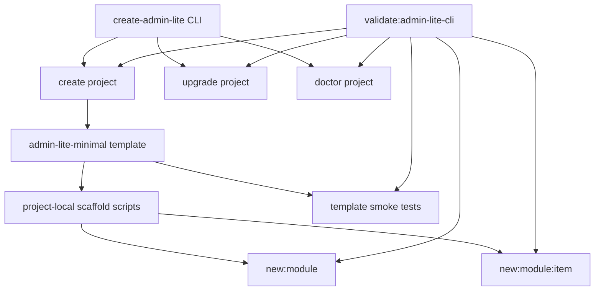

# Admin Lite CLI Productization - Plan

## Goal Capsule

- **Objective:** 将 `@one-base-template/create-admin-lite` 从“最小可运行项目生成器”升级为能支撑团队第一天开发的后台脚手架。
- **Authority:** 用户确认采用“生产化最小增强”方案；现有 `docs/plans/2026-06-30-002-feat-admin-lite-minimal-cli-plan.md` 和 `docs/plans/2026-07-01-001-feat-admin-lite-cli-upgrade-plan.md` 是边界来源。
- **Execution profile:** Standard；本轮触及 CLI 对外命令、模板脚本、仓外生成项目测试、验证脚本和文档。
- **Stop conditions:** 不引入模板市场、远程模板下载、CI secret 自动配置、默认管理模块迁移或完整 starter-crud preset。
- **Tail ownership:** 完成状态由 CLI 本地验证、仓外生成项目 `typecheck/test/build`、文档同步、changeset 和 git 提交共同证明。

---

## Product Contract

### Summary

当前 CLI 生成的 `aa` 项目可以安装、启动、构建并进入 `/home/index`，但还停留在“最小基座”阶段。
生成项目暴露 `test:run` 却没有任何测试文件，执行会因 `No test files found` 失败；同时缺少项目自检、模块生成、开发说明和验证闭环。
本轮要把默认 minimal 模板保持轻量，同时补齐团队开始二次开发必需的脚手架能力。

### Problem Frame

脚手架的价值不是只把项目复制出来，而是让接手者知道如何配置、如何验证、如何新增第一个模块，以及遇到企业 npm 认证或模板版本问题时如何自查。
如果这些能力继续只存在于 monorepo 根脚本里，仓外生成项目仍会在第一次开发时回退到人工复制和口口相传。

### Actors

- A1. **新项目开发者:** 使用 CLI 创建后台项目，并在仓外目录里新增模块、跑验证、定位环境问题。
- A2. **脚手架维护者:** 发布 CLI 新版本，维护模板、升级规则和验证脚本，避免模板与 `admin-lite` 母版持续漂移。
- A3. **企业 npm / CI 环境:** 提供 `@one-base-template/*` 包解析与认证配置，但认证信息不进入仓库或模板。

### Requirements

**Generated project baseline**

- R1. 生成项目必须保留 minimal 默认边界，只默认包含 `home` 模块和启动闭环。
- R2. 生成项目的 `test:run` 必须在初始状态下成功，不得因为没有测试文件失败。
- R3. 生成项目必须提供可仓外执行的模块级和子业务级脚手架入口，不依赖 monorepo 根目录或 `../../scripts`。
- R4. 生成项目必须继续禁止 `workspace:`、`catalog:`、本机绝对路径、真实 npm `_auth` 或 token 泄露。

**CLI lifecycle**

- R5. CLI 必须提供 `doctor` 能力，用于检查当前目录是否像 admin-lite 生成项目、模板元信息、Node/pnpm 版本、企业 npm scope registry、认证缺失风险、内部依赖协议和关键样式入口。
- R6. `doctor` 不得打印认证密钥、token、`_auth` 原值或任何可复用凭证。
- R7. 现有 `create` 与 `upgrade` 行为必须保持兼容；新增能力不能改变已有参数语义。
- R8. CLI 帮助和 README 必须说明 `create`、`upgrade`、`doctor`、模块生成和企业 npm 认证之间的关系。

**Validation and release**

- R9. `validate:admin-lite-cli` 必须覆盖本地 pack、仓外生成、doctor、自带测试、模块生成、upgrade、安全扫描、install/build 和 CSS marker。
- R10. CLI 模板行为变化必须有 changeset，真实发布后继续遵守 `<package-name>@<version>` tag 规则。
- R11. docs 站必须同步说明独立 CLI 与仓内 `new:app` 的能力差异，避免把仓内脚手架说明误认为仓外可用。

### Key Flows

- F1. **创建并自检项目**
  - **Trigger:** 开发者通过 CLI 生成新后台项目。
  - **Actors:** A1, A3
  - **Steps:** 开发者进入生成项目，运行项目自检，确认 registry、认证、模板元信息和脚本基线。
  - **Outcome:** 环境问题在安装或开发前暴露，且不泄露凭证。
  - **Covered by:** R1, R4, R5, R6

- F2. **新增第一个业务模块**
  - **Trigger:** 开发者需要在生成项目里开始业务开发。
  - **Actors:** A1
  - **Steps:** 开发者运行模块脚手架生成模块骨架，再运行子业务脚手架生成列表页骨架。
  - **Outcome:** 生成文件遵守 admin-lite 模块契约和 CRUD 基线，并可被现有路由聚合收集。
  - **Covered by:** R3, R9

- F3. **发布前验证 CLI**
  - **Trigger:** 维护者修改 CLI、模板或公共包版本。
  - **Actors:** A2
  - **Steps:** 维护者运行 CLI 验证脚本，脚本在仓外 fixture 中执行 create、doctor、模块生成、upgrade、install、test 和 build。
  - **Outcome:** CLI 包发版前能证明生成项目可独立使用。
  - **Covered by:** R8, R9, R10

### Acceptance Examples

- AE1. Given 新生成项目未做任何业务修改, when 执行 `test:run`, then 测试命令成功并至少覆盖模板基线。
- AE2. Given 新生成项目执行项目自检, when `.npmrc` 缺少 `@one-base-template` scoped registry, then 自检失败或明确告警，且不打印任何凭证值。
- AE3. Given 新生成项目执行模块脚手架, when 传入合法 `demo-management`, then `src/modules/demo-management` 下生成模块契约文件。
- AE4. Given 新生成项目执行子业务脚手架, when 目标模块存在且传入合法 `user`, then 生成列表页、路由、API、类型和表格列骨架。
- AE5. Given CLI 发布验证运行, when 模板生成项目后新增模块和子业务, then 后续 install、test、build 仍通过。

### Scope Boundaries

#### In Scope

- `@one-base-template/create-admin-lite` 新增或扩展 `doctor`、帮助文案和模板开发脚本。
- `admin-lite-minimal` 模板补齐测试基线、模块生成脚本、package scripts 和 README。
- `validate:admin-lite-cli` 扩展仓外生成项目验证。
- `apps/docs` 与包 README 同步说明生产化最小能力。
- changeset 覆盖 CLI 包发版。

#### Deferred to Follow-Up Work

- 多 preset 的仓外 CLI，如 `minimal` / `standard` / `enterprise`。
- `starter-crud` 作为可选仓外模板开关。
- CI 模板、GitLab/GitHub pipeline 文件生成。
- 模板漂移自动同步脚本，将 `apps/admin-lite` 与 CLI 模板做源级对比。
- 降低 minimal 构建大 chunk 的包拆分和按需加载优化。

#### Out of Scope

- 默认加入 `admin-management`、`log-management`、`system-management`、`demo-management` 或 `starter-crud` 模块。
- 自动写入企业 npm `_auth`、token、账号密码或 CI secret。
- 发布到公网 npm。
- 改变 `apps/admin`、`apps/portal-suite` 或公共包运行时行为。

### Dependencies / Assumptions

- 企业 npm 认证仍由用户本机或 CI 提供，模板只负责检测和提示。
- 生成项目继续使用 `@one-base-template/*` 已发布包，不依赖本仓库源码路径。
- 模块脚手架优先复用现有 `scripts/new-module.mjs` 和 `scripts/new-module-item.mjs` 的目录契约，但要适配仓外项目根目录。
- `doctor` 的网络探测以本地配置和可选 npm config 读取为主，不把外网可达性作为硬性阻断。

### Sources / Research

- `apps/admin-lite/AGENTS.md`: 定义 admin-lite 基座边界、模块契约、CRUD 红线和仓内脚手架入口。
- `scripts/new-module.mjs` / `scripts/new-module-item.mjs`: 已有模块与子业务脚手架逻辑，可作为生成项目脚本的来源模式。
- `scripts/validate-admin-lite-cli.mjs`: 已覆盖 pack、仓外生成、upgrade、install/build、安全扫描和 CSS marker，可扩展为 productization gate。
- `packages/create-admin-lite/bin/create-admin-lite.mjs`: 当前 CLI 已有 `create` / `upgrade` 路由和模板元信息写入。
- `packages/create-admin-lite/templates/admin-lite-minimal/package.json`: 当前生成项目只有 `dev/build/preview/typecheck/test/test:run`，没有 `doctor`、模块生成和可通过的测试文件。
- `apps/docs/docs/guide/admin-lite-base-app.md`: 已明确第一版仓外 CLI 不包含仓内派生应用的 preset 与管理模块。

---

## Planning Contract

### Product Contract Preservation

Product Contract is bootstrapped from the user's confirmed productionization direction and the prior minimal CLI / upgrade plans.
No product behavior from those prior plans is removed; previously deferred developer-tooling items are promoted into this plan's active scope.

### Key Technical Decisions

- KTD1. **Keep the default template minimal while adding developer tooling.** The generated app should still start as `home` only; module scaffolding is a developer action after creation, not default product payload.
- KTD2. **Make module scaffolding project-local in generated projects.** Generated projects should run module creation without reaching back to monorepo root scripts; copied or packaged project-local scripts avoid `../../scripts` and work in offline internal repos.
- KTD3. **Use `doctor` as a non-secret preflight, not a credential writer.** The CLI can detect missing registry/auth shape and unsafe project contents, but credentials remain outside the project by design.
- KTD4. **Extend the existing validation script instead of creating a second harness.** `validate:admin-lite-cli` already owns pack and warehouse-outside smoke coverage, so new create/doctor/module/test checks should land there for one release gate.
- KTD5. **Prefer a small smoke test over porting admin-lite's full test suite.** The template needs an initial passing `test:run` that protects scaffold invariants; broad bootstrap/router tests remain in `apps/admin-lite` until template drift automation is planned.

### High-Level Technical Design

The CLI remains the published entry point for create, upgrade and doctor.
The generated project owns day-to-day module creation through project-local scripts so business developers are not coupled to the source monorepo.
The release gate drives both surfaces: published CLI behavior and generated-project behavior.

### Assumptions

- `doctor` may warn instead of fail for absent npm auth when it cannot reliably distinguish unauthenticated local config from CI-provided environment credentials.
- Generated project linting should be introduced only if it can pass without root-only Vite Plus wrappers; otherwise this release should document it as deferred and rely on `typecheck/test/build/doctor`.
- Template smoke tests should avoid starting a browser; browser validation stays in the LFG browser-test step and targeted manual smoke.

### System-Wide Impact

- CLI command help becomes a public contract for teammates using enterprise npm.
- Generated project scripts become part of the template compatibility surface and must be considered by future `upgrade` rules.
- Validation time will increase because the CLI gate now exercises generated tests and module scaffolding, but this is appropriate for a release-blocking scaffold check.

### Risks & Dependencies

- **Script drift risk:** Duplicating module scaffolding logic between root scripts and template-local scripts can diverge. Mitigation: keep generated scripts close to current root script shape and add validation that generated modules build.
- **Credential false negatives:** Enterprise npm auth may come from user-level `.npmrc`, CI env, or pnpm config. Mitigation: `doctor` reports the checked source and never prints secret values.
- **Validation runtime growth:** Adding generated tests and module generation makes `validate:admin-lite-cli` slower. Mitigation: use one generated module/item fixture and avoid browser work inside the script.
- **Template upgrade interaction:** Existing projects created before this release will not automatically gain local scripts unless `upgrade` includes a migration. Mitigation: include safe additive upgrade for missing template scripts when files are absent.

---

## Implementation Units

### U1. Add CLI Doctor Preflight

- **Goal:** Add a `doctor` command that checks a generated project for environment and template-health issues without writing secrets.
- **Requirements:** R4, R5, R6, R7, R8; covers F1 and AE2.
- **Dependencies:** None.
- **Files:**
  - `packages/create-admin-lite/bin/create-admin-lite.mjs`
  - `packages/create-admin-lite/README.md`
  - `packages/create-admin-lite/templates/admin-lite-minimal/README.md`
  - `apps/docs/docs/guide/admin-lite-base-app.md`
- **Approach:** Extend command routing with `doctor [--json]`; detect project root from `package.json` and `.admin-lite-template.json`; check Node and pnpm versions, scoped registry, unsafe auth-in-project, internal dependency protocols, style source, tag style import, scripts and smoke test presence. Print a human-readable checklist by default and a machine-readable result for validation.
- **Patterns to follow:** Existing `parseArgs`, `fail`, metadata read/write and safety scanning style in `packages/create-admin-lite/bin/create-admin-lite.mjs`; safety checks from `scripts/validate-admin-lite-cli.mjs`.
- **Test scenarios:**
  - Given a valid generated project, when doctor runs, then it exits successfully and reports project metadata without secret values.
  - Given `.npmrc` lacks the scoped enterprise registry, when doctor runs, then it reports the missing registry.
  - Given a project file contains `_auth=...`, when doctor runs, then it reports an unsafe project auth entry without printing the credential body.
  - Given current directory is not a generated admin-lite project, when doctor runs, then it exits non-zero with a clear message.
- **Verification:** CLI help includes doctor; validation script can call doctor in generated fixtures and observe pass/fail behavior.

### U2. Add Project-Local Module Scaffolding

- **Goal:** Let generated projects create modules and sub-business pages without monorepo root scripts.
- **Requirements:** R3, R4, R7, R9; covers F2, AE3, AE4 and AE5.
- **Dependencies:** None.
- **Files:**
  - `packages/create-admin-lite/templates/admin-lite-minimal/package.json`
  - `packages/create-admin-lite/templates/admin-lite-minimal/scripts/new-module.mjs`
  - `packages/create-admin-lite/templates/admin-lite-minimal/scripts/new-module-item.mjs`
  - `packages/create-admin-lite/templates/admin-lite-minimal/README.md`
  - `scripts/validate-admin-lite-cli.mjs`
- **Approach:** Add template-local scripts modeled on the existing root scaffold functions but targeting `src/modules` from the generated project root. Add `new:module` and `new:module:item` package scripts. Preserve module naming, route naming, dry-run, duplicate detection and CRUD skeleton conventions.
- **Patterns to follow:** `scripts/new-module.mjs`, `scripts/new-module-item.mjs`, `apps/admin-lite/AGENTS.md` module contract and CRUD redlines.
- **Test scenarios:**
  - Given `new:module demo-management --dry-run`, when run in a generated project, then it prints the planned files and writes nothing.
  - Given `new:module demo-management`, when run in a generated project, then it creates `meta.ts`, `index.ts`, `routes.ts`, `index.vue` and `README.md`.
  - Given `new:module:item user --module demo-management`, when the module exists, then it creates list, router, API, form, constants, types and columns files.
  - Given duplicate module or item names, when scaffold runs, then it fails without overwriting files.
- **Verification:** `validate:admin-lite-cli` creates one module and one item in a warehouse-outside generated project and later typechecks/builds it.

### U3. Add Generated Project Test Baseline and Script Surface

- **Goal:** Make generated projects pass `test:run` immediately and expose the minimal scripts developers need.
- **Requirements:** R2, R3, R4, R9; covers AE1 and AE5.
- **Dependencies:** U2.
- **Files:**
  - `packages/create-admin-lite/templates/admin-lite-minimal/package.json`
  - `packages/create-admin-lite/templates/admin-lite-minimal/tests/scaffold/template-baseline.unit.test.ts`
  - `packages/create-admin-lite/templates/admin-lite-minimal/vitest.config.ts`
  - `scripts/validate-admin-lite-cli.mjs`
- **Approach:** Add a small Vitest smoke suite that checks template metadata, registry safety, style imports, script availability, and minimal module baseline. Add `test:run:file` if it can work without monorepo wrappers. Add lint only if it passes in the standalone template without root-only config; otherwise record lint as deferred rather than adding a failing script.
- **Patterns to follow:** `apps/admin-lite/tests/config/app.unit.test.ts` for config-level checks and existing generated-project safety assertions in `scripts/validate-admin-lite-cli.mjs`.
- **Test scenarios:**
  - Given a fresh generated project, when `test:run` runs, then at least one scaffold test passes.
  - Given template metadata contains unresolved placeholders, when scaffold test runs, then it fails.
  - Given style source or tag style import is missing, when scaffold test runs, then it fails.
  - Given generated project package scripts omit module scaffolding, when scaffold test runs, then it fails.
- **Verification:** Generated fixture install, `test:run`, typecheck and build all succeed inside `validate:admin-lite-cli`.

### U4. Extend Upgrade Rules for New Additive Template Files

- **Goal:** Let existing generated projects safely gain the new project-local scripts and tests through `upgrade`.
- **Requirements:** R3, R7, R9, R10.
- **Dependencies:** U2, U3.
- **Files:**
  - `packages/create-admin-lite/bin/create-admin-lite.mjs`
  - `scripts/validate-admin-lite-cli.mjs`
  - `packages/create-admin-lite/templates/admin-lite-minimal/.admin-lite-template.json`
- **Approach:** Extend upgrade planning to add missing new template files only when the target path does not exist; update package scripts additively when the current script is missing. Existing user-created files or customized scripts must be reported as conflicts or skipped rather than overwritten.
- **Patterns to follow:** Existing upgrade conflict handling, `reportFileName`, `applyUpgrade`, and old-project fixtures in `scripts/validate-admin-lite-cli.mjs`.
- **Test scenarios:**
  - Given an old generated project without local scripts, when upgrade runs, then missing scripts and tests are added.
  - Given a user-created `scripts/new-module.mjs` already exists, when upgrade runs, then the file is not overwritten and the report records the conflict.
  - Given old `package.json` lacks `new:module`, when upgrade runs, then the script is added.
  - Given user customized an existing script value, when upgrade runs, then it is not silently replaced unless the value is recognized as official.
- **Verification:** Upgrade apply fixture gains new scaffold/test files and still passes install, test and build; conflict fixture preserves user content.

### U5. Expand CLI Productization Validation

- **Goal:** Make one release gate prove the new CLI and generated-project lifecycle.
- **Requirements:** R4, R8, R9, R10; covers F3 and AE5.
- **Dependencies:** U1, U2, U3, U4.
- **Files:**
  - `scripts/validate-admin-lite-cli.mjs`
  - `package.json`
- **Approach:** Extend the existing validation flow after project generation: run doctor, install, test, module dry-run, module apply, item dry-run, item apply, typecheck/build, CSS marker validation, upgrade dry-run/apply/conflict checks and safety scans. Keep the script as the single root `validate:admin-lite-cli` entry.
- **Patterns to follow:** Current `run`, `assert`, `validateGeneratedProjectSafety`, `installAndBuildGeneratedProject`, and upgrade fixture helpers in `scripts/validate-admin-lite-cli.mjs`.
- **Test scenarios:**
  - Given a packed CLI, when validation runs, then it checks doctor success before install/build success.
  - Given generated module scripts are missing from the template, when validation runs, then it fails before publishing.
  - Given generated tests fail, when validation runs, then it fails with the generated project test output.
  - Given upgrade skips a conflicting user file, when validation runs, then the conflict report is asserted.
- **Verification:** Root validation reports create, doctor, module scaffolding, upgrade, safety, install, test and build completion.

### U6. Update Documentation, Release Notes and Operational Records

- **Goal:** Make the new scaffold capabilities discoverable and publishable.
- **Requirements:** R8, R10, R11.
- **Dependencies:** U1, U2, U3, U4, U5.
- **Files:**
  - `packages/create-admin-lite/README.md`
  - `packages/create-admin-lite/templates/admin-lite-minimal/README.md`
  - `apps/docs/docs/guide/admin-lite-base-app.md`
  - `apps/docs/docs/guide/package-release.md`
  - `.changeset/*.md`
  - `.codex/operations-log.md`
  - `.codex/testing.md`
  - `.codex/verification/2026-07-01.md`
- **Approach:** Document create/doctor/module/upgrade usage, the project-local script boundary, credentials safety, validation expectations and publishing tag rule. Add a changeset for the CLI package. Record executed verification in `.codex` after implementation.
- **Patterns to follow:** Existing admin-lite CLI and package-release docs, `.codex` 2026-07-01 entries, and changeset style already used for previous CLI updates.
- **Test scenarios:**
  - Test expectation: none -- documentation and release-note changes are verified through docs lint/build and review.
- **Verification:** docs lint/build pass and release docs mention the new CLI validation surface.

---

## Verification Contract

| Gate                      | Command                                                                                                                                                                                              | Covers | Done signal                                                                     |
| ------------------------- | ---------------------------------------------------------------------------------------------------------------------------------------------------------------------------------------------------- | ------ | ------------------------------------------------------------------------------- |
| CLI syntax                | `node --check packages/create-admin-lite/bin/create-admin-lite.mjs`                                                                                                                                  | U1, U4 | CLI entry has no syntax error                                                   |
| Template scripts syntax   | `node --check packages/create-admin-lite/templates/admin-lite-minimal/scripts/new-module.mjs` and `node --check packages/create-admin-lite/templates/admin-lite-minimal/scripts/new-module-item.mjs` | U2     | Project-local scripts parse                                                     |
| CLI package self-check    | `pnpm -C packages/create-admin-lite build`                                                                                                                                                           | U1, U4 | Help route remains executable                                                   |
| Standalone lifecycle gate | `pnpm validate:admin-lite-cli`                                                                                                                                                                       | U1-U5  | pack, create, doctor, module scaffolding, upgrade, install, test and build pass |
| Release metadata gate     | `pnpm release:validate`                                                                                                                                                                              | U1-U6  | Public package metadata and temp consumers remain valid                         |
| Docs lint                 | `pnpm -C apps/docs lint`                                                                                                                                                                             | U6     | docs lint passes                                                                |
| Docs build                | `pnpm -C apps/docs build`                                                                                                                                                                            | U6     | docs build passes                                                               |
| Browser smoke             | `agent-browser` on a generated project dev server                                                                                                                                                    | U1-U5  | generated project opens `/home/index` with no blocking runtime errors           |

---

## Definition of Done

- `create-admin-lite doctor` exists, is documented, and never prints secret values.
- Fresh generated projects contain project-local module scaffolding scripts and a passing test baseline.
- Existing generated projects can receive the additive scripts/tests through `upgrade` without overwriting user files.
- `validate:admin-lite-cli` exercises create, doctor, module scaffolding, upgrade, install, test, build, CSS markers and safety scans.
- Documentation explains create, doctor, module generation, upgrade, enterprise npm auth safety and release validation.
- CLI package changes have a changeset, and `.codex` records the executed verification.
- The working diff contains no abandoned experimental code, no local absolute paths, and no committed npm credentials.
